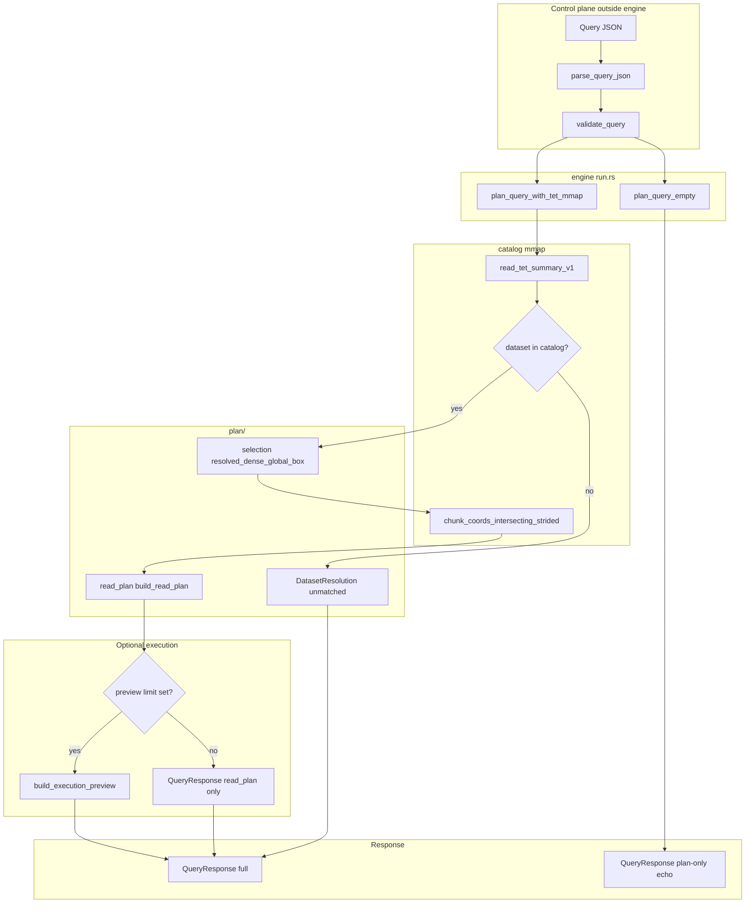
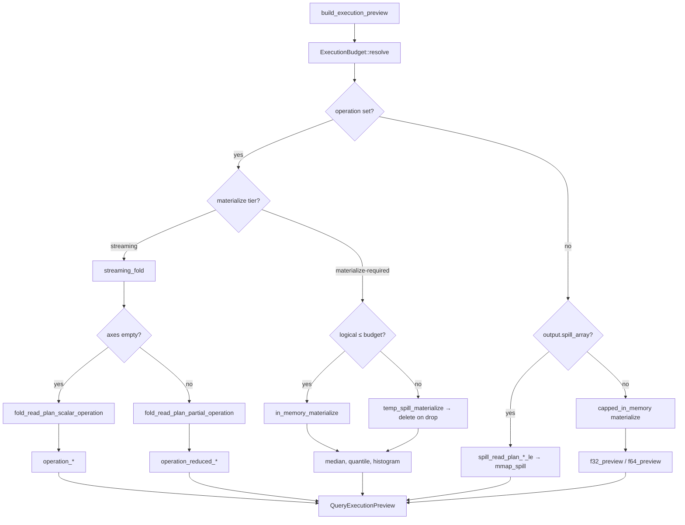

# Query engine

The **query engine** (`src/query/`) turns a validated JSON [`QueryDocument`](../src/query/types/document.rs) into a [`QueryResponse`](../src/query/types/response.rs): catalog resolution, a chunk-level **read plan**, and optionally mmap-backed decode plus **`operation`** aggregates.

JSON parsing and schema validation live in **`document.rs`**; wire types live in **`types/`** (`document`, `plan`, `response`, `error`). Planning and decode live in **`plan/`** and **`decode/`**; materialize, fold, and dtype routing in **`materialize/`**, **`fold/`**, and **`dispatch.rs`**; orchestration in **`engine/`** (`run`, `operations`, `budget`, `spill_policy`). The engine assumes a parsed, validated document and a mmap’d `.tet` byte slice when planning against a file.

See [JSON security (input and output)](#json-security-input-and-output) for trust boundaries and hardening notes.

## End-to-end flow



**CLI mapping:** `tet query` calls `validate_query` then `plan_query_empty` or `plan_query_with_tet_mmap`. `--tet PATH` supplies the mmap; `--execute` sets `raw_f32_preview_max` (default **64**; **`--preview-f32 0`** with an `operation` skips preview floats but still aggregates).

## Module map

| Submodule          | Files                                             | Responsibility                                                                              |
| ------------------ | ------------------------------------------------- | ------------------------------------------------------------------------------------------- |
| **`plan/`**        | `selection.rs`, `read_plan.rs`                    | JSON `selection` → global box + step; `ReadPlan` chunk I/O rows and logical geometry.       |
| **`decode/`**      | `chunk_decode.rs`, `indexing.rs`                  | Mmap slice bounds, codec decode (raw **0**, zstd **1**), scatter; row-major index ↔ coords. |
| **`materialize/`** | `mod.rs`, `parallel.rs`, `int.rs`, `stats.rs`     | Full/capped materialize (f32/f64/i32/i64), export spill, parallel fill, tier-C stats.       |
| **`fold/`**        | `shared.rs`, `reduction.rs`, `partial_fold.rs`, … | `FoldPlanOutcome`, `ReductionKind`, streaming partial-axis reductions.                      |
| **`dispatch.rs`**  | —                                                 | Dtype routing for materialize, spill, scalar/partial fold.                                  |
| **`engine/`**      | `run.rs`, `operations.rs`, `budget.rs`, …         | `plan_query_*`, `build_execution_preview`, budget and spill policy.                         |

Public re-exports are wired in [`engine/mod.rs`](../src/query/engine/mod.rs) and [`query/mod.rs`](../src/query/mod.rs) (crate root: `tetration::plan_query_empty`, `materialize_read_plan_f32_le`, `ExecutionBudget`, `spill_read_plan_f32_le`, …).

## Planning detail

From `QueryDocument` + catalog metadata:

1. **`plan/selection.rs`** — resolve per-axis box → `g0`, `g1_exclusive`, `step`.
2. **Chunk-touch policy** — if any `step ≠ 1`, use `strided_half_open`; else `dense_half_open_unit_step`.
3. **`catalog`** — `chunk_coords_intersecting_strided` → chunk coord list.
4. **`plan/read_plan.rs`** — `build_read_plan` → `ReadPlan` (chunk I/O rows + `logical_selection_shape`).

Each `ReadPlan.chunks` entry names one on-disk tile that intersects the selection. Chunk iteration order follows the catalog writer (last axis fastest); **decoded values** are **not** in chunk order—they are scattered into logical row-major selection order during materialization.

## Memory budget and execution strategies

Before decode, **`ExecutionBudget::resolve`** picks how much anonymous RAM the engine may use for dense in-memory paths. Precedence (highest wins):

1. Query JSON **`execution.memory_budget_bytes`**
2. Per-file **TIDX header** `memory_budget_bytes` ([`FileExecutionSettingsV1`](../src/catalog/execution.rs); see [`layout_v1.md`](layout_v1.md#chunk-index-header-32-bytes))
3. Query JSON **`execution.memory_budget_percent_bps`** (basis points; **10000 = 100%**, e.g. **2500 = 25%**)
4. Per-file TIDX **`memory_budget_percent_bps`** (**0** = engine default **25%**)
5. **256 MiB** fallback when host RAM cannot be probed

Host RAM is read best-effort via **`utils::host_memory`** (Linux `MemAvailable`, macOS free+inactive pages). Resolved budget and probe results appear on **`execution.memory_budget_bytes`**, **`execution.host_available_ram_bytes`**, **`execution.logical_selection_bytes`**, and (for **`f32`** datasets) **`execution.logical_selection_f32_bytes`** in the response.

**`build_execution_preview`** then picks a **`MemoryStrategy`** (exposed as **`execution.memory_strategy`**):

| Strategy                     | When chosen                                                        | Behavior                                                                                                                  |
| ---------------------------- | ------------------------------------------------------------------ | ------------------------------------------------------------------------------------------------------------------------- |
| **`streaming_fold`**         | Tier-A/B **`operation`** (sum, mean, min, …)                       | Single-pass fold (scalar or partial axes); no full logical `Vec`.                                                         |
| **`in_memory_materialize`**  | Tier-C **`operation`** when logical size ≤ budget                  | Full logical decode into RAM; op runs on buffer; preview from same buffer.                                                |
| **`temp_spill_materialize`** | Tier-C **`operation`** when logical size > budget                  | Full decode to engine temp file under cache allowlist; op via mmap; file deleted when execution finishes.                 |
| **`mmap_spill`**             | **`output.preferred.spill_array { handle }`** and no `operation`   | Full logical selection written row-major **dtype-native LE** to caller path; preview read from spilled file (one decode). |
| **`capped_in_memory`**       | Preview-only (no `operation`, no spill) when logical size ≤ budget | Capped materialize into **`execution.f32_preview`** or **`execution.f64_preview`** only.                                  |

When logical selection exceeds the budget and neither **`operation`** nor spill is requested, execution fails with a validation error suggesting a higher budget, an **`operation`**, or spill output.

Capped preview allocates only `min(cap, logical)` elements in the dtype-appropriate preview field (not the full logical tensor). Full materialize (`max_elements: None`) still requires a buffer sized to the logical selection.

### Spill path allowlist

Spill targets come from query JSON (`output.preferred.spill_array.handle`). **Relative handles** resolve against the **`.tet` file’s directory** (not shell cwd).

Default allowed roots (via [`SpillPathAllowlist::default_for_tet`](../src/query/engine/spill_policy.rs), applied automatically with `--tet` + `--execute`):

1. **`.tet` parent directory**
2. **Platform cache/scratch** (best-effort, each as `…/tetration/`):
   - `$XDG_CACHE_HOME/tetration` or `~/.cache/tetration` (Linux and other Unix)
   - `~/.local/cache/tetration` (macOS default when `XDG_CACHE_HOME` unset; also on Linux)
   - Windows: `%LOCALAPPDATA%\\tetration`
   - `$TMPDIR` / `$TEMP` / `$TMP` / `tetration` subdirs when creatable

**`--spill-allow DIR`** (repeatable) **adds** extra roots to that default set.

Example relative spill beside the dataset: `"handle": "slice.bin"` → next to `data.tet`. Example cache spill: `"handle": "/home/you/.cache/tetration/job-42.bin"` (or rely on a path under an allowed root).

## Materialization and operations



- **`materialize_read_plan_f32_le`** / **`materialize_read_plan_f64_le`** — full logical tensor (caller must size for `logical_f32_element_count` and element width).
- **`materialize_read_plan_f32_le_into`** / **`materialize_read_plan_f64_le_into`** — same decode path into a caller-owned buffer (no `Vec` allocation for the output).
- **`materialize_read_plan_f32_le_parallel`** / **`materialize_read_plan_f64_le_parallel`** and **`_into_parallel`** twins — Rayon over planned chunks (raw and zstd). **`build_execution_preview`** uses parallel decode when the read plan touches more than one chunk and materialization is required.
- **`planned_chunk_mmap_slices`** — zero-copy raw codec slices only (no zstd).
- **`spill_read_plan_f32_le`** / **`spill_read_plan_f64_le`** — full logical decode to a caller-owned file path (used by **`mmap_spill`** strategy).

## `QueryResponse` fields (engine-produced)

| Field                                          | When set                                                                                               |
| ---------------------------------------------- | ------------------------------------------------------------------------------------------------------ |
| `catalog`                                      | Always with `--tet` / `plan_query_with_tet_mmap`.                                                      |
| `catalog.file_execution`                       | Matched dataset; mirrors TIDX header execution settings.                                               |
| `catalog.dataset_f32_bytes`                    | Matched **`f32`** dataset; `4 × product(shape)`.                                                       |
| `catalog.dataset_f64_bytes`                    | Matched **`f64`** dataset; `8 × product(shape)`.                                                       |
| `read_plan`                                    | Dataset matched; lists touched chunks and selection geometry.                                          |
| `execution`                                    | `raw_f32_preview_max` is `Some(n)` (including `n = 0` when `operation` is set).                        |
| `execution.f32_preview`                        | First `n` logical row-major floats (`n = 0` → empty vec); **`f32`** datasets only.                     |
| `execution.f64_preview`                        | First `n` logical row-major doubles (`n = 0` → empty vec); **`f64`** datasets only.                    |
| `execution.operation_*`                        | Scalar aggregates over full logical selection; preview cap does not truncate them.                     |
| `execution.operation_reduced_*`                | Partial-axis reductions + `operation_reduced_shape`.                                                   |
| `execution.memory_strategy`                    | `streaming_fold`, `capped_in_memory`, `mmap_spill`, `in_memory_materialize`, `temp_spill_materialize`. |
| `execution.memory_budget_bytes`                | Resolved RAM budget used for this run.                                                                 |
| `execution.host_available_ram_bytes`           | Host probe at budget resolution, when available.                                                       |
| `execution.logical_selection_f32_bytes`        | `4 × logical_f32_element_count` (f32 datasets).                                                        |
| `execution.logical_selection_bytes`            | `elem_size × logical_f32_element_count` for the dataset dtype.                                         |
| `execution.spill_f32_path` / `spill_f32_bytes` | After **`mmap_spill`** decode.                                                                         |

## Chunk-touch policy strings

Stable tokens on `ReadPlan.chunk_touch_policy` (see [`CHUNK_TOUCH_POLICY`](../src/query/types/plan.rs)):

- **`dense_half_open_unit_step`** — JSON `step` omitted or 1; chunk list follows dense half-open intervals.
- **`strided_half_open`** — per-axis JSON `step` affects which chunks are touched.

## Related docs

- On-disk layout (TIDX execution header): [`layout_v1.md`](layout_v1.md)
- Roadmap checklist: [`GETTING_STARTED.md`](../GETTING_STARTED.md)

## Operations (shipped in v1)

JSON `operation` is a tagged object with decimal **`axes`** (dimension indices as strings, e.g. `"0"`):

| Operation / JSON tag | `axes: []` (scalar)                                       | Non-empty `axes` (partial reduction)                                                                               |
| -------------------- | --------------------------------------------------------- | ------------------------------------------------------------------------------------------------------------------ |
| `sum`                | `operation_sum`                                           | `operation_reduced_sum` + `operation_reduced_shape`                                                                |
| `mean`               | `operation_mean`                                          | `operation_reduced_mean` + `operation_reduced_shape`                                                               |
| `min`                | `operation_min`                                           | `operation_reduced_min` + `operation_reduced_shape`                                                                |
| `max`                | `operation_max`                                           | `operation_reduced_max` + `operation_reduced_shape`                                                                |
| `count`              | `operation_element_count`                                 | `operation_reduced_count` + `operation_reduced_shape`                                                              |
| `var`                | `operation_var`                                           | `operation_reduced_var` + `operation_reduced_shape`                                                                |
| `std`                | `operation_std`                                           | `operation_reduced_std` + `operation_reduced_shape`                                                                |
| `product`            | `operation_product`                                       | `operation_reduced_product` + `operation_reduced_shape`                                                            |
| `norm_l1`            | `operation_norm_l1`                                       | `operation_reduced_norm_l1` + `operation_reduced_shape`                                                            |
| `norm_l2`            | `operation_norm_l2`                                       | `operation_reduced_norm_l2` + `operation_reduced_shape`                                                            |
| `all_finite`         | `operation_all_finite`                                    | `operation_reduced_all_finite` + `operation_reduced_shape`                                                         |
| `any_nan`            | `operation_any_nan`                                       | `operation_reduced_any_nan` + `operation_reduced_shape`                                                            |
| `arg_min`            | `operation_argmin_index`                                  | `operation_reduced_argmin` + `operation_reduced_shape`                                                             |
| `arg_max`            | `operation_argmax_index`                                  | `operation_reduced_argmax` + `operation_reduced_shape`                                                             |
| `median`             | `operation_median`                                        | `operation_reduced_median` + `operation_reduced_shape`                                                             |
| `quantile`           | `operation_quantile` (`q` field)                          | `operation_reduced_quantile` + `operation_reduced_shape`                                                           |
| `histogram`          | `operation_histogram_counts`, `operation_histogram_edges` | `operation_reduced_histogram_counts` (flat `out_len × bins`, row-major; edges omitted) + `operation_reduced_shape` |

Population **`var` / `std`**, `ddof = 0`. **`norm_l2`** is √(sum of squares).

### Dtypes

| Wire tag | Name  | Writer | Query execution                |
| -------- | ----- | ------ | ------------------------------ |
| `1`      | `f32` | yes    | yes (preview in `f32_preview`) |
| `2`      | `f64` | yes    | yes (preview in `f64_preview`) |

Integer tags are reserved for a follow-up; [`ElementDtype`](../src/utils/dtype.rs) centralizes element size and budget math.

Quantile example (exact selection on sorted values, linear blend between adjacent ranks):

```json
{ "dataset": "a", "operation": { "quantile": { "axes": [], "q": 0.95 } } }
```

Histogram example (equal-width bins from per-cell min/max; scalar returns edges):

```json
{ "dataset": "a", "operation": { "histogram": { "axes": ["0"], "bins": 10 } } }
```

Example:

```json
{
  "dataset": "temperature",
  "operation": { "mean": { "axes": ["0"] } },
  "execution": { "memory_budget_percent_bps": 4000 }
}
```

Spill example (full logical tensor to disk, no JSON preview floats required):

```json
{
  "dataset": "temperature",
  "output": {
    "preferred": { "spill_array": { "handle": "/tmp/temp_slice.bin" } }
  }
}
```

**Execution paths today:**

- **Preview only** (no `operation`, no spill) — **`capped_in_memory`** when logical size ≤ budget.
- **Streaming ops** (`sum`, `mean`, …) — **`streaming_fold`**: scalar (`axes: []`) via **`fold_read_plan_scalar_operation`**; partial axes via **`fold_read_plan_partial_operation`**. Preview is the first `n` logical values in **`f32_preview`** or **`f64_preview`** when `raw_f32_preview_max > 0`.
- **Materialize-required ops** (`median`, `quantile`, `histogram`) — **`in_memory_materialize`** when logical size ≤ budget; **`temp_spill_materialize`** when over budget (engine temp file under cache allowlist, removed after the op). Requires `--tet` (or explicit **`SpillPathAllowlist`**) so temp paths are allowed.
- **Export spill** — **`mmap_spill`** when `output.preferred.spill_array` is set and no `operation`. Preview is read from the spilled file (single full decode; dtype-native bytes).

Supported dtypes: wire tags in [`DATASET_DTYPE_TAG_V1`](../src/catalog/mod.rs) (`f32` = 1, `f64` = 2, `i32` = 3, `i64` = 4). The preview cap does **not** truncate `operation_*` aggregates.

## Operations roadmap (planned)

New ops should declare which **implementation tier** they use. That keeps “huge tensor + one number” fast while harder stats stay explicit about memory.

### Implementation tiers

| Tier  | Name                             | When to use                                                | Engine pattern                                                                                   |
| ----- | -------------------------------- | ---------------------------------------------------------- | ------------------------------------------------------------------------------------------------ |
| **A** | **Scalar fold**                  | `axes: []`, associative or online stats                    | Extend **`fold_read_plan_scalar_operation`** / `visit_planned_chunk` (one pass, no full buffer). |
| **B** | **Partial-axis fold**            | Non-empty `axes`, element-wise combine along dimensions    | Extend **`partial_fold_read_plan_operation`** (streaming; no full logical buffer).               |
| **C** | **Materialize-required**         | Needs full logical tensor order, sort, or index of extrema | Full decode (or spill file); may add new `operation_*` response fields.                          |
| **D** | **Out of scope for `Operation`** | Writers, dtype views, foreign format import                | Separate APIs (`materialize_*`, `tet convert`, metadata), not the JSON `operation` enum.         |

### Tier 1 — shipped (v1)

**Done:** tier-A/B streaming ops (`sum`, `mean`, `min`, `max`, `count`, `var`, `std`, `product`, `norm_l1`, `norm_l2`, `all_finite`, `any_nan`, `arg_min`, `arg_max`) — scalar + partial axes.

### Tier 2 — tensor stats (shipped)

**Shipped (index ops):** `arg_min`, `arg_max` (scalar logical index; partial = index within reduced axes fiber).

| Op                           | Tier (typical) | Notes                                                                    |
| ---------------------------- | -------------- | ------------------------------------------------------------------------ |
| **`argmin` / `argmax`**      | C → **A/B**    | **Done** as `arg_min` / `arg_max`.                                       |
| **`median`**                 | C              | **Done** (scalar + partial axes).                                        |
| **`quantile` / `histogram`** | C              | **Done** (scalar + partial axes; histogram partial returns counts only). |

### Tier 3 — not `Operation` enum variants

These match the product vision but belong **beside** the reduction enum:

| Capability                              | Why separate                                                                                       |
| --------------------------------------- | -------------------------------------------------------------------------------------------------- |
| **Read / export**                       | Plan + materialize or `output.spill` ([`OutputHint::SpillArray`](../src/query/types/document.rs)). |
| **`cast` / integer dtypes**             | Needs **`i32` / `i64`** tags on disk and in materialize (`f32` / `f64` **done**).                  |
| **Named axis labels**                   | Resolve `"time"` → index via dataset metadata before reductions.                                   |
| **`rechunk` / resample**                | Writer / transform path, not read-time aggregate.                                                  |
| **Linear algebra** (`matmul`, `einsum`) | Belongs in caller libraries on materialized slabs.                                                 |
| **Spectral / ML** (FFT, CWT, conv, train) | Same: materialize or spill, then NumPy / SciPy / PyTorch / JAX — not chunk-local in the engine.      |
| **SQL / joins**                         | Explicit non-goal (see [README](../README.md)).                                                    |
| **CLI query history**                   | **Done** — platform cache JSONL (`tet history`); `.tet` footer history is **write provenance only**. |

### Non-goals for the JSON `operation` field

- Arbitrary per-chunk user callbacks (needs a sandbox and stable ABI).
- Plugin codecs or filters beyond the v1 catalog codec tags.
- Guarantees about numerical order beyond logical row-major **preview** order (aggregates are commutative where noted).
- **FFT, CWT, convolution, and ML ops** — export a hyperslab, then run ecosystem libraries (see Phase 6 Python).
- **Query replay / result cache in `.tet`** — use optional client-side memoization (`tet history` stores recent query JSON in platform cache only; does not mutate the file or skip decode by default).

When adding an op, update this table, [`Operation`](../src/query/types/document.rs), `validate_query` / `document.rs`, `reduction.rs` / `operations.rs` / `partial_fold.rs`, and (if tier **C**) `materialize_stats.rs`.

## JSON security (input and output)

The JSON query plane is a **declarative control document**, not executable code. There is no query language interpreter, SQL engine, or “run this string from the JSON” path. Security still matters in **both directions**: untrusted input must not drive memory-unsafe or out-of-policy behavior, and untrusted consumers must not treat output JSON as shell/HTML/SQL without encoding.

### Threat model (v1)

| Surface             | Source                                                   | Risk if mishandled                                                                                        |
| ------------------- | -------------------------------------------------------- | --------------------------------------------------------------------------------------------------------- |
| **Query JSON in**   | User, HTTP body, stdin, agent prompt                     | DoS (huge/deep JSON), logic abuse (absurd selection), confused deputy (if a host passes paths from JSON)  |
| **`.tet` mmap**     | Caller-chosen file path (CLI flag, not JSON field today) | Malicious file → bad index spans (mitigated in [catalog robustness](#robustness-catalog-index))           |
| **Query JSON out**  | `QueryResponse` pretty-print                             | Log/UI injection if embedded raw; unsafe `eval` in downstream scripts                                     |
| **Binary payloads** | Chunk bytes on disk                                      | Not inlined in JSON; decoded only through catalog + read plan                                             |
| **Spill path**      | `output.preferred.spill_array.handle` in query JSON      | Host path chosen by caller; validated against [`SpillPathAllowlist`](../src/query/engine/spill_policy.rs) |

The **dataset name** and **operation axis labels** in JSON are echoed in responses and errors. Treat them as **untrusted display data** unless your deployment pre-validates them.

### Input protections (today)

Implemented in [`document.rs`](../src/query/document.rs) and planning:

1. **Typed `serde` deserialization** — JSON maps into fixed structs/enums ([`QueryDocument`](../src/query/types/document.rs), [`Operation`](../src/query/types/document.rs)); there is no dynamic “operation name → callback” table fed by arbitrary strings.
2. **Closed `operation` enum** — Only the v1 ops listed above deserialize; unknown tags fail at parse time.
3. **Axis tokens restricted** — `operation.axes` entries must be non-empty **ASCII decimal** strings (e.g. `"0"`), not arbitrary expressions or Unicode axis names ([`validate_operation_axis_token`](../src/query/document.rs)).
4. **Slice sanity** — `step != 0`; when both `start` and `stop` are set, `start < stop`.
5. **Non-empty `dataset`** — Whitespace-only names rejected.
6. **Catalog binding** — After parse, selection rank/shape and axis indices are checked against the mmap’d dataset ([`plan_query_with_tet_mmap`](../src/query/engine/run.rs), [`resolved_dense_global_box`](../src/query/plan/selection.rs)); JSON cannot name chunk file offsets directly.
7. **No `.tet` path in query JSON** — Opening a `.tet` file uses the **host** path (`--tet`, API argument), not a field inside the query document. Spill **output** paths _are_ in JSON today; deployments should allowlist or rewrite them.
8. **Size and shape caps** — [`parse_query_json`](../src/query/document.rs) rejects payloads over [`QueryLimits::DEFAULT.max_json_bytes`](../src/query/document.rs) (1 MiB) and nesting depth over [`QueryLimits::DEFAULT.max_json_depth`](../src/query/document.rs) (64). [`validate_query`](../src/query/document.rs) caps `dataset` length, `selection` rank and `operation.axes` count (≤ [`MAX_NDIM`](../src/catalog/mod.rs)), and per-axis label length via **`QueryLimits::DEFAULT`**.
9. **`deny_unknown_fields`** — [`QueryDocument`](../src/query/types/document.rs) and nested input types reject unexpected JSON keys at parse time.
10. **Fuzz / property tests** — `tests/query.rs` proptest: random UTF-8 must not panic in `parse_query_json` / `validate_query`.

**Not enforced yet (deployments should add limits):**

- Canonical JSON / duplicate-key rejection (depends on `serde_json` behavior).
- Rate limiting and authentication on any HTTP wrapper around `tet query`.
- Spill path allowlist / sandbox directory policy.

### Output protections (today)

1. **`serde_json` serialization** — Strings in `QueryResponse` are JSON-escaped when written (default `tet query` pretty-print).
2. **Bounded preview arrays** — `execution.f32_preview` / `execution.f64_preview` are capped by `--preview-f32` / `raw_f32_preview_max`; aggregates use full-tensor math but return numeric summaries, not opaque blobs.
3. **Server-generated messages** — Most `message` text is produced by the engine; user strings appear mainly as echoed `dataset` / axis labels and in validation errors.

### Caller responsibilities (either direction)

#### Ingesting query JSON

- Cap input size and parse time; reject documents above policy limits before calling the library.
- Do not build shell commands, SQL, or file paths by string-concatenating raw JSON fields.
- Keep the `.tet` path under caller control (allowlist directories, no user-supplied absolute paths in multi-tenant services unless intended).
- For **`spill_array`**, validate or rewrite `handle` before execution (path traversal, writable location, quota).

**Consuming `QueryResponse` JSON**

- Treat the document as **data**, not instructions: never `eval`, `source`, or template-interpolate response JSON into code without a schema.
- When embedding in HTML, email, or terminals, apply normal contextual escaping (JSON ≠ safe HTML).
- For logs, prefer structured JSON logging or strip/control characters in echoed `dataset` names if logs are human-facing.

### Hardening roadmap

| Item                                       | Direction | Notes                                                                               |
| ------------------------------------------ | --------- | ----------------------------------------------------------------------------------- |
| Input size / depth limits                  | In        | **Done** — `QueryLimits::DEFAULT`                                                   |
| `deny_unknown_fields`                      | In        | **Done** on query input types                                                       |
| Dataset / axis length caps                 | In        | **Done** in `validate_query` via `QueryLimits`                                      |
| Spill path allowlist                       | In/out    | **Done** — `SpillPathAllowlist`, `plan_query_with_tet_mmap_ex`, CLI `--spill-allow` |
| Response schema version + stability        | Out       | Document breaking changes                                                           |
| Fuzz `parse_query_json` / `validate_query` | In        | **Basic** proptest in `tests/query.rs`                                              |
| Redaction mode for echoed fields           | Out       | Multi-tenant logging                                                                |
| Capped preview without full-buffer alloc   | In        | **Done** — bounded scatter buffer when `max_elements < logical`                     |

## Robustness (catalog index)

- Catalog robustness and index property tests: [`tests/catalog.rs`](../tests/catalog.rs).
- Query planning, materialize, operations, memory budget, f64 path, tier-C stats: [`tests/query.rs`](../tests/query.rs).
- Payload decode uses [`src/utils/f32_le.rs`](../src/utils/f32_le.rs) and [`src/utils/f64_le.rs`](../src/utils/f64_le.rs) (bytemuck; aligned cast when possible).

## Intentional gaps (v1)

- Direct callers can still use **`materialize_read_plan_f32_le`** / **`_f64_le`** (always sequential) or **`_parallel`** twins; execution picks parallel only for multi-chunk **materialize** paths. Tier-A/B **`operation`** paths use **`streaming_fold`** instead of allocating the full logical buffer.
- **`operation.axes`** uses **decimal dimension indices**, not dataset name labels.
- Spill path must lie under default roots (`.tet` dir + platform `…/tetration` cache dirs) or `--spill-allow`; relative handles are relative to the `.tet` directory.
- Integer dtypes (`i32` / `i64`) are not yet supported in writers or query execution.
- JSON hardening: byte size, depth, `deny_unknown_fields`, and string/rank caps are implemented via **`QueryLimits`**; spill path policy is enforced via **`SpillPathAllowlist`** (see [JSON security](#json-security-input-and-output)).
