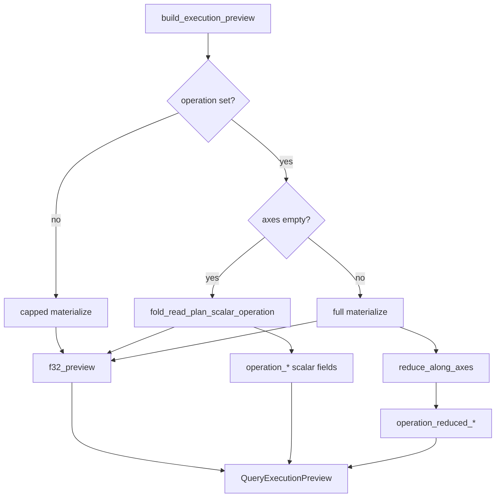

# Query engine

The **query engine** (`src/query/engine/`) turns a validated JSON [`QueryDocument`](../src/query/types.rs) into a [`QueryResponse`](../src/query/types.rs): catalog resolution, a chunk-level **read plan**, and optionally mmap-backed **`f32`** decode plus **`operation`** aggregates.

JSON parsing and schema validation live in **`document.rs`**; wire types and error enums live in **`types.rs`**. The engine assumes a parsed, validated document and a mmap’d `.tet` byte slice when planning against a file.

## End-to-end flow


**CLI mapping:** `tet query` calls `validate_query` then `plan_query_empty` or `plan_query_with_tet_mmap`. `--tet PATH` supplies the mmap; `--execute` sets `raw_f32_preview_max` (default **64**; **`--preview-f32 0`** with an `operation` skips preview floats but still aggregates).

## Module map

| Module          | File             | Responsibility                                                                                                                                                                                                                                 |
| --------------- | ---------------- | ---------------------------------------------------------------------------------------------------------------------------------------------------------------------------------------------------------------------------------------------- |
| **run**         | `run.rs`         | Public entrypoints: `plan_query_empty`, `plan_query_with_tet_mmap`; builds `QueryResponse`; dataset match / miss.                                                                                                                              |
| **selection**   | `selection.rs`   | JSON `selection` → half-open global box `[g0, g1)` and per-axis `step` (default full tensor, step 1).                                                                                                                                          |
| **read_plan**   | `read_plan.rs`   | `ReadPlan`: chunk I/O rows + selection geometry (`logical_selection_shape`, `logical_f32_element_count`).                                                                                                                                      |
| **indexing**    | `indexing.rs`    | Row-major linear index ↔ multi-dimensional coords (shared by materialize and reductions).                                                                                                                                                      |
| **materialize** | `materialize.rs` | Mmap slice + codec decode (raw **0**, zstd **1**); scatter into **logical row-major** `f32` buffer; `materialize_read_plan_f32_le` / `_into`. Shared per-chunk scatter via `scatter_chunk_into_plan`.                                          |
| **parallel**    | `parallel.rs`    | Rayon `par_iter` over `ReadPlan.chunks`; `materialize_read_plan_f32_le_parallel` / `_into_parallel` (same semantics as sequential; disjoint logical-index writes).                                                                             |
| **reduction**   | `reduction.rs`   | `ReductionKind`, `ScalarAccum`, `ScalarReductionResult`; shared scalar fold + preview field mapping.                                                                                                                                           |
| **operations**  | `operations.rs`  | `build_execution_preview`, `apply_operation`, `reduce_along_axes`; scalar (`axes: []`) delegates to **`fold_read_plan_scalar_operation`**; partial axes full materialize then axis reduce. Multi-chunk decode uses **parallel** materialize when planning execution. |

Public re-exports are wired in [`engine/mod.rs`](../src/query/engine/mod.rs) and [`query/mod.rs`](../src/query/mod.rs) (crate root: `tetration::plan_query_empty`, `materialize_read_plan_f32_le`, `materialize_read_plan_f32_le_parallel`, …).

## Planning detail

From `QueryDocument` + catalog metadata:

1. **`selection.rs`** — resolve per-axis box → `g0`, `g1_exclusive`, `step`.
2. **Chunk-touch policy** — if any `step ≠ 1`, use `strided_half_open`; else `dense_half_open_unit_step`.
3. **`catalog`** — `chunk_coords_intersecting_strided` → chunk coord list.
4. **`read_plan.rs`** — `build_read_plan` → `ReadPlan` (chunk I/O rows + `logical_selection_shape`).

Each `ReadPlan.chunks` entry names one on-disk tile that intersects the selection. Chunk iteration order follows the catalog writer (last axis fastest); **decoded values** are **not** in chunk order—they are scattered into logical row-major selection order during materialization.

## Materialization and operations



- **`materialize_read_plan_f32_le(mmap, plan, None)`** — full logical tensor (caller must size for `logical_f32_element_count`).
- **`materialize_read_plan_f32_le_into`** — same decode path into a caller-owned `&mut [f32]` (no `Vec` allocation for the output).
- **`materialize_read_plan_f32_le_parallel`** / **`materialize_read_plan_f32_le_into_parallel`** — same APIs; Rayon over planned chunks (raw and zstd). **`build_execution_preview`** (and thus **`tet query --execute`**) uses parallel decode when the read plan touches more than one chunk.
- **`planned_chunk_mmap_slices`** — zero-copy raw codec slices only (no zstd).

## `QueryResponse` fields (engine-produced)

| Field                   | When set                                                                        |
| ----------------------- | ------------------------------------------------------------------------------- |
| `catalog`               | Always with `--tet` / `plan_query_with_tet_mmap`.                               |
| `read_plan`             | Dataset matched; lists touched chunks and selection geometry.                   |
| `execution`             | `raw_f32_preview_max` is `Some(n)` (including `n = 0` when `operation` is set). |
| `execution.f32_preview` | First `n` logical row-major floats (`n = 0` → empty vec).                       |
| `execution.operation_*` | Aggregates over full logical selection (`sum`, `mean`, `min`, `max`, `count`); preview cap does not truncate them. |

## Chunk-touch policy strings

Stable tokens on `ReadPlan.chunk_touch_policy` (see [`CHUNK_TOUCH_POLICY`](../src/query/types.rs)):

- **`dense_half_open_unit_step`** — JSON `step` omitted or 1; chunk list follows dense half-open intervals.
- **`strided_half_open`** — per-axis JSON `step` affects which chunks are touched.

## Related docs

- On-disk layout: [`layout_v1.md`](layout_v1.md)
- Roadmap checklist: [`GETTING_STARTED.md`](../GETTING_STARTED.md)

## Operations (shipped in v1)

JSON `operation` is a tagged object with decimal **`axes`** (dimension indices as strings, e.g. `"0"`):

| Operation   | `axes: []` (scalar)       | Non-empty `axes` (partial reduction)                  |
| ----------- | ------------------------- | ----------------------------------------------------- |
| **`sum`**   | `operation_sum`           | `operation_reduced_sum` + `operation_reduced_shape`   |
| **`mean`**  | `operation_mean`          | `operation_reduced_mean` + `operation_reduced_shape`  |
| **`min`**   | `operation_min`           | `operation_reduced_min` + `operation_reduced_shape`   |
| **`max`**   | `operation_max`           | `operation_reduced_max` + `operation_reduced_shape`   |
| **`count`** | `operation_element_count` | `operation_reduced_count` + `operation_reduced_shape` |

Example:

```json
{ "dataset": "temperature", "operation": { "mean": { "axes": ["0"] } } }
```

**Execution paths today:**

- **Preview only** (no `operation`) — capped materialize into `execution.f32_preview`.
- **Scalar reductions** (`sum`, `mean`, `min`, `max`, `count` with `axes: []`) — single-pass **`fold_read_plan_scalar_operation`** (no full logical `Vec`); preview is still the first `n` logical values.
- **Partial reductions** — full logical materialize, then `apply_operation` (same axis rules as scalar, different output fields).

All of the above are **`f32`** / `DTYPE_F32` only. The preview cap does **not** truncate `operation_*` aggregates.

## Operations roadmap (planned)

New ops should declare which **implementation tier** they use. That keeps “huge tensor + one number” fast while harder stats stay explicit about memory.

### Implementation tiers

| Tier  | Name                             | When to use                                                | Engine pattern                                                                                      |
| ----- | -------------------------------- | ---------------------------------------------------------- | --------------------------------------------------------------------------------------------------- |
| **A** | **Scalar fold**                  | `axes: []`, associative or online stats                    | Extend **`fold_read_plan_scalar_operation`** / `visit_planned_chunk` (one pass, no full buffer).    |
| **B** | **Axis reduce**                  | Non-empty `axes`, element-wise combine along dimensions    | Reuse **`reduce_along_axes`** in `operations.rs` after full materialize (today’s path for partial `sum` / `mean` / `min` / `max` / `count`). |
| **C** | **Materialize-required**         | Needs full logical tensor order, sort, or index of extrema | Full decode (or future spill file); may add new `operation_*` response fields.                      |
| **D** | **Out of scope for `Operation`** | Writers, dtype views, foreign format import                | Separate APIs (`materialize_*`, `tet convert`, metadata), not the JSON `operation` enum.            |

### Tier 1 — next ops (same `axes` model as `sum` / `mean`)

**Shipped (v1):** `sum`, `mean`, `min`, `max`, `count` (scalar + partial axes).

Good follow-ups: small JSON surface, mostly tier **A** / **B**.

| Op                  | Tier (typical) | Notes                                                 |
| ------------------- | -------------- | ----------------------------------------------------- |
| **`product`**       | A + B          | Like `sum`; watch overflow → `f64` or explicit error. |
| **`var` / `std`**   | A + B          | Welford or two-pass; pairs with existing **`mean`**.  |
| **`norm`** (L1, L2) | A              | L1 = sum of abs; L2 = sqrt(sum of squares).           |

Example wire shape (not implemented yet):

```json
{ "operation": { "std": { "axes": ["1"] } } }
```

**Suggested PR order:** `var` / `std` → `product` → `all_finite` / `any_nan` (see tier 2).

### Tier 2 — still tensor stats, heavier

| Op                           | Tier (typical) | Notes                                                                           |
| ---------------------------- | -------------- | ------------------------------------------------------------------------------- |
| **`argmin` / `argmax`**      | C              | Return logical or global indices, not just a scalar value.                      |
| **`median`**                 | C              | Exact median needs storage or selection; per-chunk median is not global median. |
| **`quantile` / `histogram`** | C              | Often fixed bins so partial results can be merged.                              |
| **`all_finite` / `any_nan`** | A              | Cheap validation ops; useful in ingest/QA pipelines.                            |

### Tier 3 — not `Operation` enum variants

These match the product vision but belong **beside** the reduction enum:

| Capability                              | Why separate                                                     |
| --------------------------------------- | ---------------------------------------------------------------- |
| **Read / export**                       | Plan + materialize or `output.spill` (see `OutputHint`).         |
| **`cast` / extra dtypes**               | Needs `f64`, integers, etc. on disk and in materialize.          |
| **Named axis labels**                   | Resolve `"time"` → index via dataset metadata before reductions. |
| **`rechunk` / resample**                | Writer / transform path, not read-time aggregate.                |
| **Linear algebra** (`matmul`, `einsum`) | Belongs in caller libraries on materialized slabs.               |
| **SQL / joins**                         | Explicit non-goal (see [README](../README.md)).                  |

### Non-goals for the JSON `operation` field

- Arbitrary per-chunk user callbacks (needs a sandbox and stable ABI).
- Plugin codecs or filters beyond the v1 catalog codec tags.
- Guarantees about numerical order beyond logical row-major **preview** order (aggregates are commutative where noted).

When adding an op, update this table, [`Operation`](../src/query/types.rs), `validate_query` / `document.rs`, `reduction.rs` / `operations.rs`, and (if tier **A**) `materialize.rs` fold support.

## Intentional gaps (v1)

- Direct callers can still use **`materialize_read_plan_f32_le`** (always sequential) or **`_parallel`** (always Rayon); execution picks parallel only for multi-chunk **materialize** paths. Scalar **`operation`** with **`axes: []`** uses **`fold_read_plan_scalar_operation`** instead of allocating the full logical buffer.
- Materialization and operations are **`f32`** / `DTYPE_F32` only.
- `operation.axes` uses **decimal dimension indices**, not dataset name labels.
- No spill-to-disk or streaming API for tensors larger than RAM.
