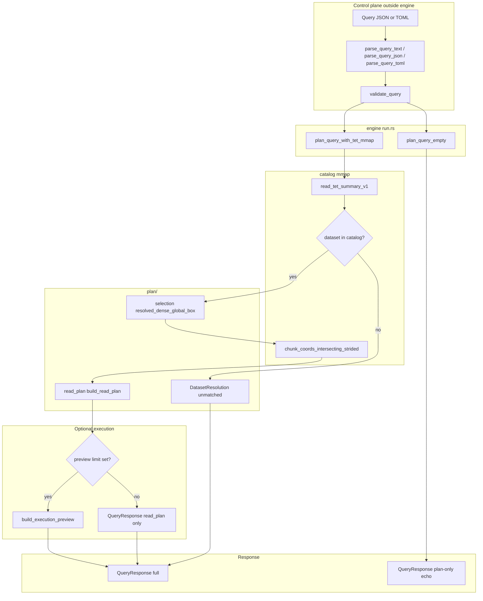
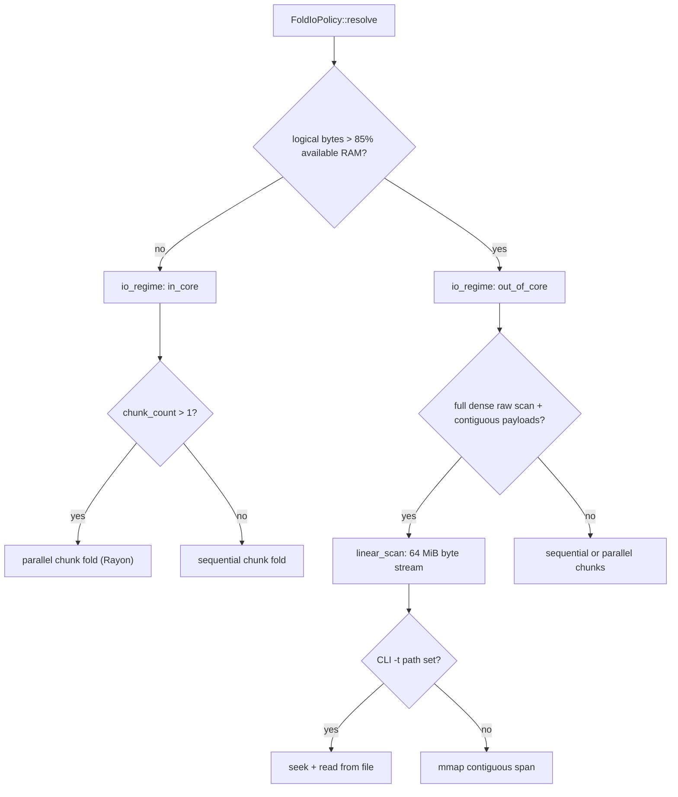
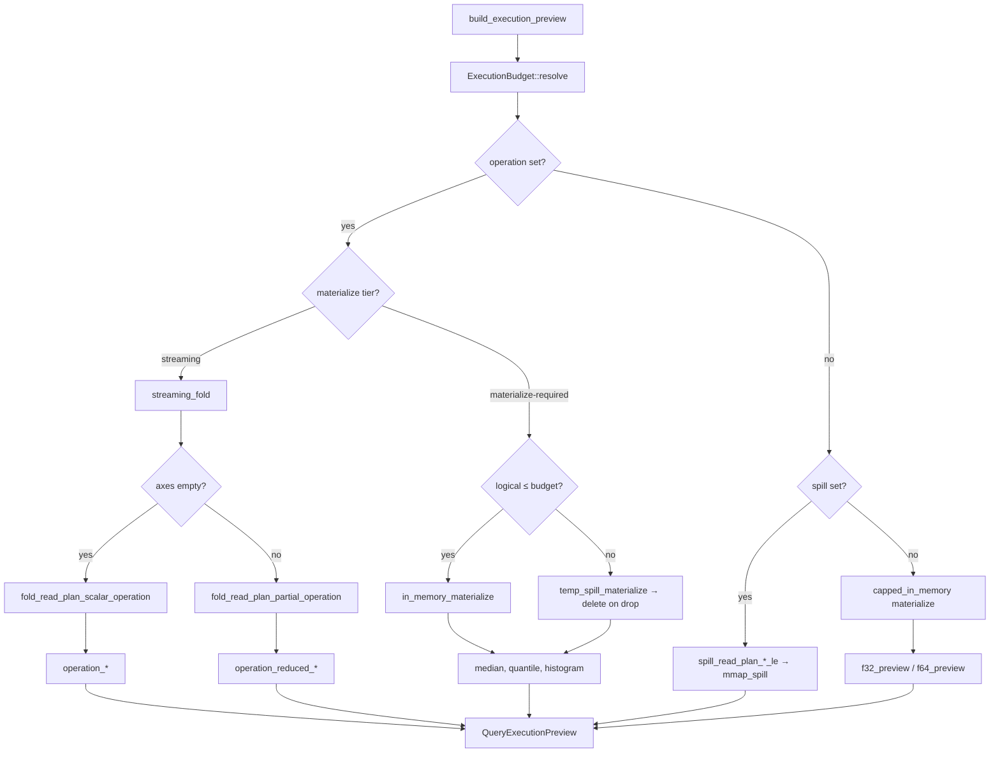

# Query engine

The **query engine** (`src/query/`) turns a validated [`QueryDocument`](../src/query/types/document.rs) into a [`QueryResponse`](../src/query/types/response.rs): catalog resolution, a chunk-level **read plan**, and optionally mmap-backed decode plus **`operation`** aggregates.

**Input:** flat **JSON** or **TOML** profiles (`parse_query_json`, [`parse_query_toml`](../src/query/document_toml.rs), [`parse_query_text`](../src/query/document.rs) with auto-detect). TOML is converted to a JSON value tree, then the same wire parser runs. The canonical wire shape is defined in **`document_wire.rs`**; size/depth limits and **`validate_query`** live in **`document.rs`**. Wire types live in **`types/`** (`document`, `plan`, `response`, `error`). Planning and decode live in **`plan/`** and **`decode/`**; materialize, fold, and dtype routing in **`materialize/`**, **`fold/`**, and **`dispatch.rs`**; orchestration in **`engine/`** (`run`, `operations`, `budget`, `spill_policy`). The engine assumes a parsed, validated document and a mmap’d `.tet` byte slice when planning against a file.

See [JSON security (input and output)](#json-security-input-and-output) for trust boundaries and hardening notes (apply to TOML input as well).

## End-to-end flow



**CLI mapping:** `tet query [QUERY]` reads **`.json` / `.toml`**, inline JSON/TOML, or stdin (`-` or omit). Format: file extension **`.json` / `.toml`**, else leading **`{`** → JSON, otherwise TOML ([`detect_query_input_format`](../src/query/document.rs)). Then `validate_query` and `plan_query_empty` or `plan_query_with_tet_mmap_ex`. **`-t PATH`** supplies the mmap; **`-x` / `--execute`** runs `build_execution_preview` and sets `raw_f32_preview_max` from **`--preview`** (alias **`--preview-f32`**): default **64** for **`--format full|json`**, **0** for **`stats|quiet|table`** when omitted; explicit **`0`** with an **`operation`** skips preview arrays but still aggregates; explicit **`0`** with top-level **`"spill"`** (no reduction key) still runs **`mmap_spill`** export. **`tet qhist`** still stores query JSON in the platform cache, not TOML.

Success stdout is formatted by [`format_query_response`](../src/query/cli/output/mod.rs) (presentation only — the in-memory [`QueryResponse`](../src/query/types/response.rs) is unchanged for embedders).

| `--format`       | Short | stdout                                                                                                                                         |
| ---------------- | ----- | ---------------------------------------------------------------------------------------------------------------------------------------------- |
| `full` (default) | —     | Pretty JSON, full `QueryResponse`                                                                                                              |
| `json`           | —     | Compact one-line JSON, full envelope                                                                                                           |
| `stats`          | —     | Slim JSON: status, catalog/read_plan summary, `execution` aggregates — no `read_plan.chunks[]`, no preview arrays                              |
| `plan`           | —     | Slim JSON: catalog + `read_plan` summary only (no `chunks[]`, no `execution`; **`-x`** still runs decode — use without **`-x`** for plan-only) |
| `quiet`          | `-q`  | One line: `dataset=… status=… op=…` + primary aggregate (best after **`-x`** with `operation`)                                                 |
| `table`          | —     | ASCII tables: query summary, `read_plan`, execution I/O, scalar/partial **result**, optional **preview** sample (like `tet info`)              |

**Phase 10 (device routing):** optional `execution.device` or `tet query … --device` — see [Phase 10 — optional GPU](#phase-10--optional-gpu-experimental).

Errors always go to **stderr** with non-zero exit. See [CLI query output](#cli-query-output).

## Phase 10 — optional GPU (experimental)

**Status:** merged on `main` ([PR #12](https://github.com/Latka-Industries/tetration/pull/12)). Routing, CUDA/Metal/ROCm kernels, **streaming per-chunk GPU fold**, decode∥GPU pipeline, and multi-GPU sharding ship behind optional crate features. **CPU streaming fold remains the fast, correct default** for large and extra-large selections on typical Apple Silicon benches.

### What it does today

1. **Host decode** — mmap + chunk decode unchanged (raw **0** / zstd **1**).
2. **GPU path (when routed)** — tier-A/B **`f32`** or **`f16`** (promoted to **`f32`** per chunk on device):
   - **Dense:** host **`f32`** materialize when the host-RAM gate allows, then block-reduce on device for **`sum`**, **`mean`**, **`min`**, **`max`**, **`count`** (`tetration-metal` / `tetration-gpu` / `tetration-rocm`).
   - **Streaming:** per-chunk decode + device partials + host merge ([`streaming_fold.rs`](../src/query/gpu/streaming_fold.rs)) when a full dense buffer does not fit; optional decode∥GPU pipeline when `chunk_count > 1`.
   - **Multi-GPU:** `cuda:multi` / `rocm:multi` shard chunks across visible devices ([`multi.rs`](../src/query/gpu/multi.rs)).
   - **Host (`f64` SIMD):** population **`var`** / **`std`** (`ddof = 0`) — per-chunk on the streaming path; dense path uses host SIMD after materialize (GPU f32 sumsq was numerically wrong at ~10⁹ elements).
3. **CPU streaming** — parallel chunk fold or out-of-core linear scan when GPU is not selected or falls back.

Preview JSON / **`stats`**: `device_requested`, `device_used`, `device_fallback_reason`, `device_gpu_reduce`, `device_gpu_pipeline`, `device_gpu_multi`.

### `execution.device` / `--device`

| Token             | Behavior                                                                                                                                                |
| ----------------- | ------------------------------------------------------------------------------------------------------------------------------------------------------- |
| `cpu`             | Always host streaming fold.                                                                                                                             |
| `auto`            | Metal on macOS when `tetration-metal` enabled, else CUDA device 0 when `tetration-gpu` enabled, else CPU. Skips GPU below **64 MiB** logical selection. |
| `metal`           | Apple GPU when feature enabled; else CPU + `gpu_feature_disabled`.                                                                                      |
| `cuda` / `cuda:N` | NVIDIA GPU when feature enabled; else CPU + `gpu_feature_disabled`.                                                                                     |

CLI **`--device`** overrides query JSON `execution.device` (needs **`-x`**).

### Host-RAM gate (before materialize)

GPU scalar paths need a dense host buffer of size `logical_f32_bytes`. Routing refuses device when:

- logical bytes **>** **85%** of probed host RAM (`MemAvailable` / macOS free+inactive), or
- logical bytes **>** **8 GiB** when RAM cannot be probed.

When the selection exceeds the host materialize budget, the engine uses **per-chunk streaming GPU fold** (decode one tile → device reduce → merge) instead of a dense `vec![f32; n]`. If GPU is disabled or fails at runtime, execution falls back to CPU streaming fold (`gpu_host_materialize_exceeded` is no longer a route-time refusal when GPU features are enabled).

Constants: [`GPU_HOST_MATERIALIZE_RAM_FRACTION`](../src/query/device.rs), [`GPU_HOST_MATERIALIZE_UNKNOWN_HOST_CAP_BYTES`](../src/query/device.rs).

### Other fallback reasons

| `device_fallback_reason`        | Meaning                                                                                                                                       |
| ------------------------------- | --------------------------------------------------------------------------------------------------------------------------------------------- |
| `gpu_feature_disabled`          | Requested GPU but crate not built with `tetration-metal` / `tetration-gpu`.                                                                   |
| `gpu_host_materialize_exceeded` | Dense host buffer over budget; engine may still use **streaming GPU fold** when GPU features are enabled (not an automatic CPU-only refusal). |
| `auto_below_size_threshold`     | `auto` and logical selection &lt; 64 MiB.                                                                                                     |
| `gpu_unsupported_dtype`         | Not dense **`f32`**.                                                                                                                          |
| `gpu_unsupported_op`            | Tier-C / partial-axis / unsupported scalar op.                                                                                                |
| `tier_c_materialize`            | `median` / `quantile` / `histogram` need full materialize path.                                                                               |
| `preview_or_spill_only`         | No `operation` in query.                                                                                                                      |

Runtime GPU failures (VRAM, decode, kernel) fall back to CPU with reasons such as `gpu_vram_exceeded`, `gpu_runtime_error`, `gpu_host_decode_failed` (see [`scalar_fold.rs`](../src/query/gpu/scalar_fold.rs)).

### Build features

```bash
cargo build --release --features tetration-metal   # macOS only (Metal dep is target-gated)
cargo build --release --features tetration-gpu     # Linux/Windows + NVIDIA
# tetration-rocm — same CUDA/NVRTC path today; mutually exclusive with tetration-gpu
```

Default crate features do **not** link GPU backends. CI uses platform feature sets (not `--all-features` on Linux/Windows) — see [`.github/workflows/ci.yml`](../.github/workflows/ci.yml).

### Bench expectations ([`fixtures/README.md`](../fixtures/README.md))

| Tier                 | Typical `device` (auto / metal on M4 Max)  | Notes                                                                                        |
| -------------------- | ------------------------------------------ | -------------------------------------------------------------------------------------------- |
| **large** (~6.7 GiB) | `metal` when RAM allows                    | sum/mean/min/max on GPU; var/std on host SIMD.                                               |
| **extra** (~20 GiB)  | `cpu` or streaming GPU when built + routed | Dense path refused by host-RAM gate on most laptops; streaming GPU or CPU streaming ~2 s/op. |

Use **`mise run bench:cpu`** for apples-to-apples CPU timing; **`bench:metal`** / **`bench:gpu`** to exercise device routing.

### Device tokens (Phase 10)

| Token                            | Meaning                                                                      |
| -------------------------------- | ---------------------------------------------------------------------------- |
| `cpu`                            | Host streaming fold only.                                                    |
| `auto`                           | Metal (macOS) or CUDA device 0 when features enabled; skips GPU &lt; 64 MiB. |
| `metal`                          | Apple GPU.                                                                   |
| `cuda` / `cuda:N`                | NVIDIA GPU _N_.                                                              |
| `cuda:multi`                     | Shard chunks across all visible CUDA devices (Rayon + merge).                |
| `rocm` / `rocm:N` / `rocm:multi` | ROCm build (`tetration-rocm`); same kernel path as CUDA today.               |

Execution preview: `device_gpu_pipeline`, `device_gpu_multi`.

### Not implemented (Phase 10)

- GPU tier-C ops, dtypes other than **`f32`** / **`f16`** (promoted to `f32` on device).
- Meaningful speedup over CPU streaming on unified-memory Macs for full-tensor tier-A/B ops (current architecture).

## Scalability: read-many and Phase 10

**Deployment model (v1):** [README — Concurrency and scale](../README.md#concurrency-and-scale), [layout v1 — Concurrency](layout_v1.md#concurrency-informative).

```text
Write (once)  →  seal .tet  →  N readers (mmap, independent queries)
                                    │
                    CPU: parallel chunk fold / linear scan (today)
                    GPU: dense or streaming per-chunk partials
                         cuda:multi / rocm:multi shard across devices
```

| Milestone                  | What                                                                                           | Unlocks                                                         |
| -------------------------- | ---------------------------------------------------------------------------------------------- | --------------------------------------------------------------- |
| **A — read-many contract** | Document + test sealed-file concurrent readers                                                 | Many CPU workers / hosts on one `.tet` without format changes   |
| **B — streaming GPU fold** | Per-chunk decode + device partials ([`streaming_fold.rs`](../src/query/gpu/streaming_fold.rs)) | Large `f32` tier-A/B without full-RAM `vec![f32; n]` — **done** |
| **C — overlap I/O**        | Decode ∥ GPU pipeline in [`streaming_fold.rs`](../src/query/gpu/streaming_fold.rs)             | Throughput — **done**                                           |
| **D — multi-GPU**          | `cuda:multi` / `rocm:multi` chunk shards ([`multi.rs`](../src/query/gpu/multi.rs))             | Machine-scale throughput — **done**                             |

**A** does not require GPU. **B–D** reuse the CPU fold merge algebra on the host.

Integration test: [`src/tests/concurrent_query.rs`](../src/tests/concurrent_query.rs) (library threads + optional `tet query` process smoke).

## Module map

| Submodule          | Files                                                                                                                                          | Responsibility                                                                                                                                                                                                         |
| ------------------ | ---------------------------------------------------------------------------------------------------------------------------------------------- | ---------------------------------------------------------------------------------------------------------------------------------------------------------------------------------------------------------------------- |
| **`plan/`**        | `selection.rs`, `read_plan.rs`                                                                                                                 | JSON `selection` → global box + step; `ReadPlan` chunk I/O rows and logical geometry.                                                                                                                                  |
| **`decode/`**      | `chunk_decode.rs`, `indexing.rs`                                                                                                               | Mmap slice bounds, codec decode (raw **0**, zstd **1**), scatter; row-major index ↔ coords.                                                                                                                            |
| **`materialize/`** | `mod.rs`, `parallel.rs`, `int.rs`, `stats.rs`                                                                                                  | Full/capped materialize (all wire dtypes), export spill, parallel fill, tier-C stats.                                                                                                                                  |
| **`fold/`**        | `fold_policy.rs`, `linear_scan.rs`, `shared.rs`, `reduction/`, `variance_simd/`, `parallel/` (Rayon), `partial/` (`fields`, `float`, `int`), … | `FoldIoPolicy` / I/O regime; out-of-core **linear scan**; `FoldPlanOutcome`, `ReductionKind`; SIMD bulk sum/var/min-max on tier-A/B slabs (all supported float/integer tags); parallel + partial-axis streaming folds. |
| **`dispatch.rs`**  | —                                                                                                                                              | Dtype routing for materialize, spill, scalar/partial fold.                                                                                                                                                             |
| **`engine/`**      | `run.rs`, `operations.rs`, `budget.rs`, …                                                                                                      | `plan_query_*`, `build_execution_preview`, budget and spill policy.                                                                                                                                                    |
| **`cli/`**         | `history.rs`, `info.rs`, `output/` (`mod.rs`, `plan.rs`, `quiet.rs`, `stats.rs`, …)                                                            | Platform query history JSONL; `tet info` formatters; `QueryOutputFormat`, `format_query_response`.                                                                                                                     |

Public re-exports are wired in [`engine/mod.rs`](../src/query/engine/mod.rs) and [`query/mod.rs`](../src/query/mod.rs) (`tetration::query::plan_query_empty`, `format_query_response`, `QueryOutputFormat`, `materialize_read_plan_f32_le`, `ExecutionBudget`, `spill_read_plan_f32_le`, …). Crate root exposes modules plus [`prelude`](../src/lib.rs).

## CLI query output

Library entry: **`format_query_response(&QueryResponse, QueryOutputFormat)`** — builds strings for `tet` stdout without mutating the response.

- **`full` / `json`** — serialize the full envelope (pretty vs compact). Use for debugging, golden tests, and tools that need `read_plan.chunks[]`.
- **`stats`** — [`stats.rs`](../src/query/cli/output/stats.rs) projects catalog/read*plan summaries and execution I/O + `operation*\*` fields; omits chunk rows and preview arrays.
- **`quiet`** — [`quiet.rs`](../src/query/cli/output/quiet.rs) prints a single `key=value` line; partial-axis reductions include reduced shape + sample values. Plan-only and unmatched-dataset cases still emit a short line.

Implement new presentation in **`src/query/cli/output/`**; keep planning/execution in **`engine/`**.

## Planning detail

From `QueryDocument` + catalog metadata:

1. **`plan/selection.rs`** — resolve per-axis box → `g0`, `g1_exclusive`, `step`.
2. **Chunk-touch policy** — if any `step ≠ 1`, use `strided_half_open`; else `dense_half_open_unit_step`.
3. **`catalog`** — `chunk_coords_intersecting_strided` → chunk coord list.
4. **`plan/read_plan.rs`** — `build_read_plan` → `ReadPlan` (chunk I/O rows + `logical_selection_shape`).

Each `ReadPlan.chunks` entry names one on-disk tile that intersects the selection. Chunk iteration order follows the catalog writer (last axis fastest); **decoded values** are **not** in chunk order—they are scattered into logical row-major selection order during materialization.

## Memory budget and execution strategies

Before decode, **`ExecutionBudget::resolve`** picks how much anonymous RAM the engine may use for dense in-memory paths. Precedence (highest wins):

1. Query JSON **`execution.memory_budget_bytes`**
2. Per-file **TIDX header** `memory_budget_bytes` ([`FileExecutionSettingsV1`](../src/catalog/execution.rs); see [`layout_v1.md`](layout_v1.md#chunk-index-header-32-bytes))
3. Query JSON **`execution.memory_budget_percent_bps`** (basis points; **10000 = 100%**, e.g. **2500 = 25%**)
4. Per-file TIDX **`memory_budget_percent_bps`** (**0** = engine default **25%**)
5. **256 MiB** fallback when host RAM cannot be probed

Host RAM is read best-effort via **`utils::host_memory`** (Linux `MemAvailable`, macOS free+inactive pages). Resolved budget and probe results appear on **`execution.memory_budget_bytes`**, **`execution.host_available_ram_bytes`**, **`execution.logical_selection_bytes`**, and (for **`f32`** datasets) **`execution.logical_selection_f32_bytes`** in the response.

**`build_execution_preview`** then picks a **`MemoryStrategy`** (exposed as **`execution.memory_strategy`**):

| Strategy                     | When chosen                                                        | Behavior                                                                                                                                                                                 |
| ---------------------------- | ------------------------------------------------------------------ | ---------------------------------------------------------------------------------------------------------------------------------------------------------------------------------------- |
| **`streaming_fold`**         | Tier-A/B **`operation`** (sum, mean, min, …)                       | Single-pass fold (scalar or partial axes); no full logical `Vec`. I/O path is chosen by [`FoldIoPolicy`](../src/query/fold/fold_policy.rs) — see [Adaptive fold I/O](#adaptive-fold-io). |
| **`in_memory_materialize`**  | Tier-C **`operation`** when logical size ≤ budget                  | Full logical decode into RAM; op runs on buffer; preview from same buffer.                                                                                                               |
| **`temp_spill_materialize`** | Tier-C **`operation`** when logical size > budget                  | Full decode to engine temp file under cache allowlist; op via mmap; file deleted when execution finishes.                                                                                |
| **`mmap_spill`**             | Top-level **`"spill": "path"`** and no reduction key               | Full logical selection written row-major **dtype-native LE** to caller path; preview read from spilled file (one decode).                                                                |
| **`capped_in_memory`**       | Preview-only (no `operation`, no spill) when logical size ≤ budget | Capped materialize into **`execution.f32_preview`** or **`execution.f64_preview`** only.                                                                                                 |

When logical selection exceeds the budget and neither **`operation`** nor spill is requested, execution fails with a validation error suggesting a higher budget, an **`operation`**, or spill output.

Capped preview allocates only `min(cap, logical)` elements in the dtype-appropriate preview field (not the full logical tensor). Full materialize (`max_elements: None`) still requires a buffer sized to the logical selection.

### Spill path allowlist

Spill targets come from query JSON (`"spill": "…"`). **Relative paths** resolve against the **`.tet` file’s directory** (not shell cwd).

Default allowed roots (via [`SpillPathAllowlist::default_for_tet`](../src/query/engine/spill_policy.rs), applied automatically with `--tet` + `--execute`):

1. **Canonical `.tet` parent directory** — any resolved spill path **under that directory tree** is allowed (e.g. `data.tet` in `/tmp` → `/tmp/other/out.bin` is valid; use a subdirectory like `/tmp/tet_home/data.tet` if you need a narrower root).
2. **Platform cache/scratch** (best-effort, each as `…/tetration/`):
   - `$XDG_CACHE_HOME/tetration` or `~/.cache/tetration` (Linux and other Unix)
   - `~/.local/cache/tetration` (macOS default when `XDG_CACHE_HOME` unset; also on Linux)
   - Windows: `%LOCALAPPDATA%\\tetration`
   - `$TMPDIR` / `$TEMP` / `$TMP` / `tetration` subdirs when creatable

**`--spill-allow DIR`** (repeatable) **adds** extra roots to that default set.

Example relative spill beside the dataset: `"spill": "slice.bin"` → next to `data.tet`. Example cache spill: `"spill": "/home/you/.cache/tetration/job-42.bin"` (or any path under an allowed root).

### Adaptive fold I/O

Before tier-A/B fold runs, [`FoldIoPolicy::resolve`](../src/query/fold/fold_policy.rs) compares **logical selection bytes** to **~85% of probed host available RAM** (`IN_CORE_IO_HEADROOM_BPS` = 8500). The result drives chunk visit order and whether fold uses **parallel chunks**, **sequential chunks**, or **linear scan**.



| Mode                      | When                                                                                                      | I/O pattern                                                                                                                 |
| ------------------------- | --------------------------------------------------------------------------------------------------------- | --------------------------------------------------------------------------------------------------------------------------- |
| **Parallel chunk fold**   | In-core, `chunk_count > 1`, not linear scan                                                               | Rayon over chunks; mmap/decode per chunk; bulk SIMD per slab when geometry allows                                           |
| **Sequential chunk fold** | In-core single chunk, or out-of-core without linear-scan eligibility, or `execution.fold_parallel: false` | Chunks in catalog order or ascending `payload_offset` when `sequential_io`                                                  |
| **Linear scan**           | Out-of-core + full dense unit-step selection + raw codec + adjacent payloads summing to logical size      | One contiguous byte span; 64 MiB windows; [`push_f32_le_bytes`](../src/query/fold/reduction/value_accum.rs) SIMD per window |

**Linear scan eligibility:** [`detect_contiguous_raw_span`](../src/query/fold/linear_scan.rs) requires every touched chunk to use **raw codec 0**, payloads **abutting in plan order**, and total raw bytes = logical selection size. Converted multi-chunk **`f32`** grids from `write_raw_array_file` typically satisfy this; zstd chunks or strided partial selections do not.

**Query hint:** `"execution": { "fold_parallel": false }` forces **sequential chunk visits** (offset order when full dense); it does **not** enable linear scan. `"fold_parallel": true` on an out-of-core linear-scan query keeps parallel chunk fold instead of linear scan.

**Execution stats** (also in **`--format stats`**): `io_regime` (`in_core` / `out_of_core` / `unknown`), `fold_parallel`, `fold_linear_scan`.

### Streaming fold performance

**Behavior:** [`streaming_fold`](../src/query/engine/budget.rs) tier-A/B ops route through [`scalar_fold`](../src/query/dispatch.rs). When [`use_parallel_fold`](../src/query/fold/parallel/mod.rs) is true, fold uses Rayon over disjoint chunks (partial [`ValueAccum`](../src/query/fold/reduction/value_accum.rs) + `merge_from`). When **`fold_linear_scan`** is true, fold uses [`fold_read_plan_scalar_linear`](../src/query/fold/linear_scan.rs) instead — single-threaded byte stream, no per-chunk mmap fan-out.

So a full-file scalar op still **reads every payload byte once** and **touches every element** for the accumulator. Wall time is dominated by **page-cache / disk bandwidth** and CPU over the selection when out-of-core, or **memory bandwidth + cores** when in-core.

**SIMD bulk fold (tier-A/B, `f32` slabs):** [`variance_simd`](../src/query/fold/variance_simd/mod.rs) — NEON on aarch64, SSE2 on x86_64, scalar fallback:

- **mean / sum / var / std** — single-pass sum + sum-of-squares per slab → Welford merge
- **min / max** — single-pass vector min/max per slab → accumulator merge

Used in both parallel chunk fold (dense 1D tile bulk path) and linear scan windows.

**Reference (local, gitignored fixture):** `fixtures/extra_large/h5/tensor_20gb.tet` — 20 GiB logical **`f32`**, 320 chunks × 64 MiB raw (`dataset`: **`data`**). After convert from `tensor_20gb.h5`:

```bash
echo '{"dataset":"data","layout_version":1,"mean":[]}' \
  | tet query -t fixtures/extra_large/h5/tensor_20gb.tet -x -q
```

**In-core** (data fits ~85% of available RAM — e.g. Mac Studio with ~25 GiB free): expect on the order of **~0.5–0.6 s** for full-tensor **mean** and tier-A/B ops over 20 GiB (~30–40 GiB/s effective from warm page cache). Response checks:

- **`execution.memory_strategy`**: `"streaming_fold"`
- **`execution.io_regime`**: `"in_core"`
- **`execution.fold_parallel`**: `true`
- **`execution.fold_linear_scan`**: `false`
- **`read_plan.chunk_count`**: `320`

**Out-of-core** (logical size exceeds headroom — e.g. 20 GiB on a 16 GiB machine with ~6 GiB free): linear scan when payloads are contiguous. Warm 2nd pass on Apple Silicon (May 2026): **~3.7–4.0 s** for mean/sum/std/var/min/max (~2× warm HDF5 on the same fixture). Response checks:

- **`execution.io_regime`**: `"out_of_core"`
- **`execution.fold_linear_scan`**: `true`
- **`execution.fold_parallel`**: `false`

See [`fixtures/bench_results/latest.md`](../fixtures/bench_results/latest.md) for archived runs (`mise run bench:h5`).

A **single-chunk** slice (`selection` stopping after 16 777 216 elements) completes quickly — same fold path, one chunk.

**Parallel vs linear:** per-chunk parallel fold wins when the working set fits page cache. Linear scan wins when parallel mmap/page faults thrash on cold or oversubscribed RAM but payloads are one contiguous raw hyperslab on disk.

## Materialization and operations



- **`materialize_read_plan_f32_le`** / **`materialize_read_plan_f64_le`** — full logical tensor (caller must size for `logical_f32_element_count` and element width).
- **`materialize_read_plan_f32_le_into`** / **`materialize_read_plan_f64_le_into`** — same decode path into a caller-owned buffer (no `Vec` allocation for the output).
- **`materialize_read_plan_f32_le_parallel`** / **`materialize_read_plan_f64_le_parallel`** and **`_into_parallel`** twins — Rayon over planned chunks (raw and zstd). **`build_execution_preview`** uses parallel decode when the read plan touches more than one chunk and materialization is required.
- **`planned_chunk_mmap_slices`** — zero-copy raw codec slices only (no zstd).
- **`spill_read_plan_f32_le`** / **`spill_read_plan_f64_le`** — full logical decode to a caller-owned file path (used by **`mmap_spill`** strategy).

## `QueryResponse` fields (engine-produced)

| Field                                          | When set                                                                                               |
| ---------------------------------------------- | ------------------------------------------------------------------------------------------------------ |
| `catalog`                                      | Always with `--tet` / `plan_query_with_tet_mmap`.                                                      |
| `catalog.file_execution`                       | Matched dataset; mirrors TIDX header execution settings.                                               |
| `catalog.dataset_f32_bytes`                    | Matched **`f32`** dataset; `4 × product(shape)`.                                                       |
| `catalog.dataset_f64_bytes`                    | Matched **`f64`** dataset; `8 × product(shape)`.                                                       |
| `read_plan`                                    | Dataset matched; lists touched chunks and selection geometry.                                          |
| `execution`                                    | `raw_f32_preview_max` is `Some(n)` (including `n = 0` when an **`operation`** or **`spill`** is set).  |
| `execution.f32_preview`                        | First `n` logical row-major floats (`n = 0` → empty vec); **`f32`** datasets only.                     |
| `execution.f64_preview`                        | First `n` logical row-major doubles (`n = 0` → empty vec); **`f64`** datasets only.                    |
| `execution.operation_*`                        | Scalar aggregates over full logical selection; preview cap does not truncate them.                     |
| `execution.operation_reduced_*`                | Partial-axis reductions + `operation_reduced_shape`.                                                   |
| `execution.memory_strategy`                    | `streaming_fold`, `capped_in_memory`, `mmap_spill`, `in_memory_materialize`, `temp_spill_materialize`. |
| `execution.io_regime`                          | `in_core`, `out_of_core`, or `unknown` (streaming fold only).                                          |
| `execution.fold_parallel`                      | Whether parallel chunk fold was selected (`streaming_fold`).                                           |
| `execution.fold_linear_scan`                   | Whether out-of-core linear byte-stream fold ran (`streaming_fold`).                                    |
| `execution.memory_budget_bytes`                | Resolved RAM budget used for this run.                                                                 |
| `execution.host_available_ram_bytes`           | Host probe at budget resolution, when available.                                                       |
| `execution.logical_selection_f32_bytes`        | `4 × logical_f32_element_count` (f32 datasets).                                                        |
| `execution.logical_selection_bytes`            | `elem_size × logical_f32_element_count` for the dataset dtype.                                         |
| `execution.spill_f32_path` / `spill_f32_bytes` | After **`mmap_spill`** decode.                                                                         |

## Chunk-touch policy strings

Stable tokens on `ReadPlan.chunk_touch_policy` (see [`CHUNK_TOUCH_POLICY`](../src/query/types/plan.rs)):

- **`dense_half_open_unit_step`** — JSON `step` omitted or 1; chunk list follows dense half-open intervals.
- **`strided_half_open`** — per-axis JSON `step` affects which chunks are touched.

## Related docs

- On-disk layout (TIDX execution header): [`layout_v1.md`](layout_v1.md)
- Axis metadata (dimension names vs coordinates): [`layout_v1.md` — axis metadata](layout_v1.md#axis-metadata-phase-7-baseline)
- Roadmap summary: [`README.md`](../README.md#library-use)

## Dimension names vs coordinate labels

Each **query document** names **one dataset** in the `.tet` file (`"dataset": "temperature"`); multi-dataset join/group is out of scope (see [Tier 3](#tier-3--not-operation-enum-variants)). Decimal axis indices remain the internal wire form; footer metadata ([`layout_v1.md — axis metadata`](layout_v1.md#axis-metadata-phase-7-baseline)) enables two user-facing layers:

### Dimension names (axis names)

- **One string per axis** — the name of the dimension, not each slot along it.
- **Query use (shipped):** resolve `"mean": "time"` → internal axis `0` at plan time when footer `dim_names` is set; decimal indices and numeric wire forms still accepted.
- **Size:** O(`ndim`) — fits in dataset attrs or file header.

### Coordinate labels (index values)

- **One value per position** along an axis — e.g. every row’s timestamp, every column’s variable name, every station id.
- **Query use (shipped):** `selection[].start_label` / `stop_label` resolve to axis indices at plan time when footer `coords` exist (axis key = `dim_names[d]` or `"d"`). Filter-by-value and group-by remain later.
- **Size:** O(`shape[d]`) — may be stored inline, as attrs, or as a separate 1D array/dataset in the file.

### What labels do _not_ imply

| Capability                      | Needs                                                               |
| ------------------------------- | ------------------------------------------------------------------- |
| `"mean": "time"` (axis name)    | **Dimension names** only                                            |
| Slice rows 100–200 by index     | **Today** — numeric `selection`                                     |
| Slice by timestamp / station id | **Coordinate labels** on `selection` (**done**); range/filter later |
| Fast lookup without full scan   | Coords **+ optional index** (sorted array, hash, …)                 |
| `GROUP BY station`              | Coords on key axis **+ group-by op**                                |
| SQL-style join two datasets     | Two queries or spill + caller; **non-goal** as full engine          |

**Append vs join:** growing one dataset over time is a **writer** concern (Phase 7 session writer). Combining two datasets on shared coordinates is **join** semantics — metadata helps **alignment checks**, not automatic join in the query engine.

## Query document (JSON and TOML)

The wire format is **flat**: one top-level reduction key per document (`mean`, `sum`, …). Nested `"operation": { … }` is **rejected** at parse time. **TOML** uses the same keys and semantics after conversion to JSON (see examples below).

### JSON examples

| Write                                                           | Meaning (internal `operation.axes`)                                               |
| --------------------------------------------------------------- | --------------------------------------------------------------------------------- |
| `"mean": []`                                                    | Scalar mean over all selected elements                                            |
| `"mean": 0`                                                     | Mean over axis **0** (`["0"]`)                                                    |
| `"sum": [0, 1]`                                                 | Partial reduction over axes 0 and 1                                               |
| `"quantile": { "q": 0.95, "axis": 0 }`                          | Quantile on axis 0 (or `"axes": [0, 1]` for multi-axis)                           |
| `"histogram": { "bins": 10, "axis": 0 }`                        | Histogram on axis 0                                                               |
| `"histogram": { "bins": 10, "min": 0, "max": 1 }`               | Histogram with fixed edge range (both `min` and `max` required)                   |
| `"nan_count": []` / `"nan_count": 0`                            | Count of NaN elements (scalar / partial)                                          |
| `"inf_count": []` / `"inf_count": 0`                            | Count of ±infinity elements (scalar / partial; integers contribute 0)             |
| `"null_count": []` or `{ "fill": 99, "axis": 0 }`               | Count of fill-missing values (fill from query or dataset attrs)                   |
| `"selection": [{ "start_label": "r0", "stop_label": "r1" }, …]` | Half-open slice by coordinate label (requires footer `coords`)                    |
| `"covariance": { "axis": 0 }` / `"correlation": 0`              | Rank-2 only; `axis` = observation dimension; `operation_*_order` = variable count |
| `"execution": { "memory_budget_percent": 40 }`                  | **40%** of host RAM (`memory_budget_percent_bps` = 4000 internally)               |
| `"execution": { "fold_parallel": false }`                       | Force sequential chunk visits (not linear scan); default is policy-driven         |
| `"spill": "slice.bin"`                                          | Full logical tensor export beside the `.tet` parent (allowlist applies)           |

`memory_budget_percent_bps` is still accepted in JSON for embedders; serialization prefers **`memory_budget_percent`**. Nested `"output": { … }` is rejected (use **`spill`**). Axis specs accept **non-negative decimals** (`0`) or **dimension names** (`"time"`) when `dim_names` is in footer metadata — see [Dimension names vs coordinate labels](#dimension-names-vs-coordinate-labels).

At most **one** reduction key per document. Unknown top-level fields are rejected (`deny_unknown_fields` style in [`parse_query_value`](../src/query/document_wire.rs)).

### TOML examples

Equivalent TOML for the same wire (parametric ops use inline tables; `selection` uses `[[selection]]` array-of-tables):

| TOML                                                      | Same as JSON                                            |
| --------------------------------------------------------- | ------------------------------------------------------- |
| `dataset = "temperature"` / `mean = []`                   | `"dataset": "temperature", "mean": []`                  |
| `mean = 0`                                                | `"mean": 0`                                             |
| `sum = [0, 1]`                                            | `"sum": [0, 1]`                                         |
| `[quantile]` / `q = 0.95` / `axis = 0`                    | `"quantile": { "q": 0.95, "axis": 0 }`                  |
| `[execution]` / `memory_budget_percent = 40`              | `"execution": { "memory_budget_percent": 40 }`          |
| `spill = "slice.bin"`                                     | `"spill": "slice.bin"`                                  |
| `[[selection]]` / `start = 0` / `stop = 100` / `step = 2` | `"selection": [{ "start": 0, "stop": 100, "step": 2 }]` |

```toml
dataset = "temperature"
mean = []

[[selection]]
start = 0
stop = 100
step = 2
```

```bash
tet query q.toml -t data.tet -x -q
```

**Not supported in TOML:** nested `"operation"` / `"output"` objects (same rejection as JSON). Line-oriented query profiles remain a possible later front-end.

## Operations (shipped in v1)

Reduction keys map to response fields below. **Scalar** = empty axis list (`[]` on the wire); **partial** = one or more axis indices.

| Operation / JSON key | Scalar (`[]`)                                             | Non-empty axes (partial reduction)                                                                                 |
| -------------------- | --------------------------------------------------------- | ------------------------------------------------------------------------------------------------------------------ |
| `sum`                | `operation_sum`                                           | `operation_reduced_sum` + `operation_reduced_shape`                                                                |
| `mean`               | `operation_mean`                                          | `operation_reduced_mean` + `operation_reduced_shape`                                                               |
| `min`                | `operation_min`                                           | `operation_reduced_min` + `operation_reduced_shape`                                                                |
| `max`                | `operation_max`                                           | `operation_reduced_max` + `operation_reduced_shape`                                                                |
| `count`              | `operation_element_count`                                 | `operation_reduced_count` + `operation_reduced_shape`                                                              |
| `var`                | `operation_var`                                           | `operation_reduced_var` + `operation_reduced_shape`                                                                |
| `std`                | `operation_std`                                           | `operation_reduced_std` + `operation_reduced_shape`                                                                |
| `product`            | `operation_product`                                       | `operation_reduced_product` + `operation_reduced_shape`                                                            |
| `norm_l1`            | `operation_norm_l1`                                       | `operation_reduced_norm_l1` + `operation_reduced_shape`                                                            |
| `norm_l2`            | `operation_norm_l2`                                       | `operation_reduced_norm_l2` + `operation_reduced_shape`                                                            |
| `all_finite`         | `operation_all_finite`                                    | `operation_reduced_all_finite` + `operation_reduced_shape`                                                         |
| `any_nan`            | `operation_any_nan`                                       | `operation_reduced_any_nan` + `operation_reduced_shape`                                                            |
| `arg_min`            | `operation_argmin_index`                                  | `operation_reduced_argmin` + `operation_reduced_shape`                                                             |
| `arg_max`            | `operation_argmax_index`                                  | `operation_reduced_argmax` + `operation_reduced_shape`                                                             |
| `median`             | `operation_median`                                        | `operation_reduced_median` + `operation_reduced_shape`                                                             |
| `quantile`           | `operation_quantile` (`q` field)                          | `operation_reduced_quantile` + `operation_reduced_shape`                                                           |
| `histogram`          | `operation_histogram_counts`, `operation_histogram_edges` | `operation_reduced_histogram_counts` (flat `out_len × bins`, row-major; edges omitted) + `operation_reduced_shape` |

Population **`var` / `std`**, `ddof = 0`. **`norm_l2`** is √(sum of squares).

### Dtypes

| Wire tag | Name  | Writer | Query execution                                 |
| -------- | ----- | ------ | ----------------------------------------------- |
| `1`      | `f32` | yes    | yes (preview in `f32_preview`)                  |
| `2`      | `f64` | yes    | yes (preview in `f64_preview`)                  |
| `3`      | `i32` | yes    | yes (aggregates promote to `f64` in fold paths) |
| `4`      | `i64` | yes    | yes (aggregates promote to `f64` in fold paths) |

Element size and budget math: [`ElementDtype`](../src/utils/dtype.rs).

Quantile example (exact selection on sorted values, linear blend between adjacent ranks):

```json
{ "dataset": "a", "quantile": { "q": 0.95 } }
```

Histogram example (equal-width bins from per-cell min/max; scalar returns edges):

```json
{ "dataset": "a", "histogram": { "axis": 0, "bins": 10 } }
```

Example:

```json
{
  "dataset": "temperature",
  "mean": 0,
  "execution": { "memory_budget_percent": 40 }
}
```

Spill example (full logical tensor to disk, no JSON preview floats required):

```json
{
  "dataset": "temperature",
  "spill": "/tmp/temp_slice.bin"
}
```

**Execution paths today:**

- **Preview only** (no `operation`, no spill) — **`capped_in_memory`** when logical size ≤ budget.
- **Streaming ops** (`sum`, `mean`, …) — **`streaming_fold`**: scalar (empty axis list) via **`fold_read_plan_scalar_operation`**; partial axes via **`fold_read_plan_partial_operation`**. Preview is the first `n` logical values in dtype-matched preview arrays (`f32_preview`, `u8_preview`, …) when `raw_f32_preview_max > 0`.
- **Materialize-required ops** (`median`, `quantile`, `histogram`) — **`in_memory_materialize`** when logical size ≤ budget; **`temp_spill_materialize`** when over budget (engine temp file under cache allowlist, removed after the op). Requires `--tet` (or explicit **`SpillPathAllowlist`**) so temp paths are allowed.
- **Export spill** — **`mmap_spill`** when **`spill`** is set and no reduction key. Preview is read from the spilled file (single full decode; dtype-native bytes).

Supported dtypes: wire tags in [`DATASET_DTYPE_TAG_V1`](../src/catalog/mod.rs) — `f32` = 1, `f64` = 2, `i32` = 3, `i64` = 4, `u8` = 5, `u16` = 6, `i16` = 7, `u32` = 8, `f16` = 9, `u64` = 10 (see [`layout_v1.md`](layout_v1.md)). Tier-A/B aggregates promote integers to **`f64`** in `operation_*`. The preview cap does **not** truncate `operation_*` aggregates. **`f16` partial-axis** fold is still rejected at dispatch (scalar tier-A/B only).

## Operations roadmap (planned)

New ops should declare which **implementation tier** they use. That keeps “huge tensor + one number” fast while harder stats stay explicit about memory.

### Implementation tiers

| Tier  | Name                             | When to use                                                | Engine pattern                                                                                                                         |
| ----- | -------------------------------- | ---------------------------------------------------------- | -------------------------------------------------------------------------------------------------------------------------------------- |
| **A** | **Scalar fold**                  | `axes: []`, associative or online stats                    | [`scalar_fold`](../src/query/dispatch.rs) → parallel chunks (in-core), linear scan (out-of-core contiguous raw), or sequential chunks. |
| **B** | **Partial-axis fold**            | Non-empty `axes`, element-wise combine along dimensions    | [`partial`](../src/query/fold/partial/mod.rs) with same `FoldIoPolicy` chunk ordering.                                                 |
| **C** | **Materialize-required**         | Needs full logical tensor order, sort, or index of extrema | Full decode (or spill file); may add new `operation_*` response fields.                                                                |
| **D** | **Out of scope for `Operation`** | Writers, dtype views, foreign format import                | Separate APIs (`materialize_*`, `tet convert`, metadata), not the JSON `operation` enum.                                               |

### Tier 1 — shipped (v1)

**Done:** tier-A/B streaming ops (`sum`, `mean`, `min`, `max`, `count`, `var`, `std`, `product`, `norm_l1`, `norm_l2`, `all_finite`, `any_nan`, `arg_min`, `arg_max`) — scalar + partial axes.

### Tier 2 — tensor stats (shipped)

**Shipped (index ops):** `arg_min`, `arg_max` (scalar logical index; partial = index within reduced axes fiber).

| Op                           | Tier (typical) | Notes                                                                    |
| ---------------------------- | -------------- | ------------------------------------------------------------------------ |
| **`argmin` / `argmax`**      | C → **A/B**    | **Done** as `arg_min` / `arg_max`.                                       |
| **`median`**                 | C              | **Done** (scalar + partial axes).                                        |
| **`quantile` / `histogram`** | C              | **Done** (scalar + partial axes; histogram partial returns counts only). |

### Phase 9 ops (shipped)

See [README — Library use](../README.md#library-use) and Phase 9 notes in this file.

| Op (wire key)                | Tier (typical) | Notes                                                                                                                         |
| ---------------------------- | -------------- | ----------------------------------------------------------------------------------------------------------------------------- |
| **`nan_count`**              | A/B            | Count of NaN elements; complements **`any_nan`** (boolean).                                                                   |
| **`inf_count`**              | A/B            | Count of ±infinity; complements **`all_finite`** (boolean).                                                                   |
| **`null_count`**             | A/B            | Fill from query `fill` or footer attrs (`_FillValue`, `missing_value`, `fill_value`).                                         |
| **Related QC counts**        | A/B            | Deferred — e.g. `finite_count`.                                                                                               |
| **Histogram `min` / `max`**  | C              | **Done** — caller-supplied bin edges on scalar histogram (both required when either set).                                     |
| **Covariance / correlation** | C              | **Done** — rank-2; `axis` = observation dimension (`operation_covariance` / `operation_correlation` row-major `order×order`). |
| **Named axis in JSON**       | —              | `"mean": "time"` via `dim_names` (resolver only).                                                                             |
| **Coord label slice**        | —              | **Done** — `selection` `start_label` / `stop_label` ([`resolve_selection.rs`](../src/query/resolve_selection.rs)).            |

### Tier 3 — not `Operation` enum variants

These match the product vision but belong **beside** the reduction enum:

| Capability                                | Why separate                                                                                                                                                                 |
| ----------------------------------------- | ---------------------------------------------------------------------------------------------------------------------------------------------------------------------------- |
| **Read / export**                         | Plan + materialize or `output.spill` ([`OutputHint::SpillArray`](../src/query/types/document.rs)); **`.tet` → Zarr v3** via `tet export` ([`export`](../src/export/mod.rs)). |
| **`cast` / integer dtypes**               | **`i32` / `i64`** on disk and in materialize/query fold (**done**).                                                                                                          |
| **Named axis labels**                     | **Done** — footer `dim_names` resolves `"time"` to axis index at plan time ([`resolve_axes.rs`](../src/query/resolve_axes.rs)).                                              |
| **Coordinate labels / filter-by-value**   | **Slice by label** shipped (`start_label` / `stop_label`); filter-by-value / group-by and optional lookup index remain later.                                                |
| **`rechunk` / resample**                  | Writer / transform path, not read-time aggregate.                                                                                                                            |
| **Linear algebra** (`matmul`, `einsum`)   | Belongs in caller libraries on materialized slabs.                                                                                                                           |
| **Spectral / ML** (FFT, CWT, conv, train) | Same: materialize or spill, then NumPy / SciPy / PyTorch / JAX — not chunk-local in the engine.                                                                              |
| **SQL / joins**                           | Explicit non-goal (see [README](../README.md)).                                                                                                                              |
| **CLI query history**                     | **Done** — platform cache JSONL (`tet qhist list` / `run`; `hist` alias); `TET_QUERY_HISTORY_MAX` rotation; `.tet` footer via `tet info --history`.                          |

### Non-goals for the JSON `operation` field

- Arbitrary per-chunk user callbacks (needs a sandbox and stable ABI).
- Plugin codecs or filters beyond the v1 catalog codec tags.
- Guarantees about numerical order beyond logical row-major **preview** order (aggregates are commutative where noted).
- **FFT, CWT, convolution, and ML ops** — export a hyperslab, then run ecosystem libraries (future Python bindings repo — see [`ffi.md`](ffi.md)).
- **Query replay / result cache in `.tet`** — use optional client-side memoization (`tet qhist` stores recent query JSON in platform cache only; does not mutate the file or skip decode by default).

When adding an op, update this table, [`Operation`](../src/query/types/document.rs), `validate_query` / `document.rs`, `reduction/` / `operations.rs` / `partial/`, and (if tier **C**) `materialize_stats.rs`.

## JSON security (input and output)

The query control plane (JSON or TOML input) is a **declarative document**, not executable code. There is no query language interpreter, SQL engine, or “run this string from the payload” path. Security still matters in **both directions**: untrusted input must not drive memory-unsafe or out-of-policy behavior, and untrusted consumers must not treat output JSON as shell/HTML/SQL without encoding.

### Threat model (v1)

| Surface                | Source                                                   | Risk if mishandled                                                                                                  |
| ---------------------- | -------------------------------------------------------- | ------------------------------------------------------------------------------------------------------------------- |
| **Query JSON/TOML in** | User, HTTP body, stdin, agent prompt                     | DoS (huge/deep payload), logic abuse (absurd selection), confused deputy (if a host passes paths from the document) |
| **`.tet` mmap**        | Caller-chosen file path (CLI flag, not JSON field today) | Malicious file → bad index spans (mitigated in [catalog robustness](#robustness-catalog-index))                     |
| **Query JSON out**     | `QueryResponse` pretty-print                             | Log/UI injection if embedded raw; unsafe `eval` in downstream scripts                                               |
| **Binary payloads**    | Chunk bytes on disk                                      | Not inlined in JSON; decoded only through catalog + read plan                                                       |
| **Spill path**         | `"spill"` string in query JSON/TOML                      | Host path chosen by caller; validated against [`SpillPathAllowlist`](../src/query/engine/spill_policy.rs)           |

The **dataset name** and **operation axis labels** in JSON are echoed in responses and errors. Treat them as **untrusted display data** unless your deployment pre-validates them.

### Input protections (today)

Implemented in [`document.rs`](../src/query/document.rs) and planning:

1. **Typed `serde` deserialization** — JSON maps into fixed structs/enums ([`QueryDocument`](../src/query/types/document.rs), [`Operation`](../src/query/types/document.rs)); there is no dynamic “operation name → callback” table fed by arbitrary strings.
2. **Closed `operation` enum** — Only the v1 ops listed above deserialize; unknown tags fail at parse time.
3. **Axis tokens restricted** — `operation.axes` entries must be non-empty **ASCII decimal** indices (e.g. `"0"`) or **dimension names** (e.g. `"time"`); arbitrary expressions and coordinate values are rejected ([`validate_operation_axis_token`](../src/query/document.rs)).
4. **Slice sanity** — `step != 0`; when both `start` and `stop` are set, `start < stop`.
5. **Non-empty `dataset`** — Whitespace-only names rejected.
6. **Catalog binding** — After parse, selection rank/shape and axis indices are checked against the mmap’d dataset ([`plan_query_with_tet_mmap`](../src/query/engine/run.rs), [`resolved_dense_global_box`](../src/query/plan/selection.rs)); JSON cannot name chunk file offsets directly.
7. **No `.tet` path in query JSON** — Opening a `.tet` file uses the **host** path (`--tet`, API argument), not a field inside the query document. Spill **output** paths _are_ in JSON today; deployments should allowlist or rewrite them.
8. **Size and shape caps** — [`parse_query_json`](../src/query/document.rs) / [`parse_query_toml`](../src/query/document_toml.rs) reject payloads over [`QueryLimits::DEFAULT.max_json_bytes`](../src/query/document.rs) (1 MiB) and nesting depth over [`QueryLimits::DEFAULT.max_json_depth`](../src/query/document.rs) (64) on the converted JSON tree. [`validate_query`](../src/query/document.rs) caps `dataset` length, `selection` rank and `operation.axes` count (≤ [`MAX_NDIM`](../src/catalog/mod.rs)), and per-axis label length via **`QueryLimits::DEFAULT`**.
9. **`deny_unknown_fields`** — [`QueryDocument`](../src/query/types/document.rs) and nested input types reject unexpected keys at parse time (after TOML→JSON conversion).
10. **Fuzz / property tests** — `src/tests/query.rs` proptest: random UTF-8 must not panic in `parse_query_json` / `validate_query`; TOML covered by unit tests on representative profiles.

**Not enforced yet (deployments should add limits):**

- Canonical JSON / duplicate-key rejection (depends on `serde_json` behavior).
- Rate limiting and authentication on any HTTP wrapper around `tet query`.
- Spill path allowlist / sandbox directory policy.

### Output protections (today)

1. **`serde_json` serialization** — Strings in `QueryResponse` are JSON-escaped when written (`tet query --format full` pretty-print, or `json` / `stats` compact JSON).
2. **Bounded preview arrays** — `execution.f32_preview` / `execution.f64_preview` are capped by `--preview-f32` / `raw_f32_preview_max`; aggregates use full-tensor math but return numeric summaries, not opaque blobs.
3. **Server-generated messages** — Most `message` text is produced by the engine; user strings appear mainly as echoed `dataset` / axis labels and in validation errors.

### Caller responsibilities (either direction)

#### Ingesting query JSON or TOML

- Cap input size and parse time; reject documents above policy limits before calling the library.
- Do not build shell commands, SQL, or file paths by string-concatenating raw document fields.
- Keep the `.tet` path under caller control (allowlist directories, no user-supplied absolute paths in multi-tenant services unless intended).
- For **`spill`**, validate or rewrite the path before execution (path traversal, writable location, quota).

**Consuming `QueryResponse` JSON**

- Treat the document as **data**, not instructions: never `eval`, `source`, or template-interpolate response JSON into code without a schema.
- When embedding in HTML, email, or terminals, apply normal contextual escaping (JSON ≠ safe HTML).
- For logs, prefer structured JSON logging or strip/control characters in echoed `dataset` names if logs are human-facing.

### Hardening roadmap

| Item                                       | Direction | Notes                                                                                                       |
| ------------------------------------------ | --------- | ----------------------------------------------------------------------------------------------------------- |
| Input size / depth limits                  | In        | **Done** — `QueryLimits::DEFAULT`                                                                           |
| `deny_unknown_fields`                      | In        | **Done** on query input types                                                                               |
| Dataset / axis length caps                 | In        | **Done** in `validate_query` via `QueryLimits`                                                              |
| Spill path allowlist                       | In/out    | **Done** — `SpillPathAllowlist`, `plan_query_with_tet_mmap_ex`, CLI `--spill-allow`                         |
| Response schema version + stability        | Out       | Document breaking changes                                                                                   |
| Fuzz `parse_query_json` / `validate_query` | In        | **Basic** proptest in `src/tests/query.rs`; TOML smoke in same module                                       |
| TOML query front-end                       | In        | **Done** — [`parse_query_toml`](../src/query/document_toml.rs), CLI `.toml` + auto-detect                   |
| Redaction mode for echoed fields           | Out       | Multi-tenant logging                                                                                        |
| Capped preview without full-buffer alloc   | In        | **Done** — bounded scatter buffer when `max_elements < logical`                                             |
| Parallel streaming fold (tier A/B ops)     | In        | **Done** — Rayon over chunks when in-core; see [Adaptive fold I/O](#adaptive-fold-io)                       |
| Out-of-core linear scan                    | In        | **Done** — contiguous raw hyperslab + SIMD windows; [PR #7](https://github.com/Latka-Industries/tetration/pull/7) |

## Robustness (catalog index)

- Catalog robustness and index property tests: [`src/tests/catalog.rs`](../src/tests/catalog.rs).
- Query planning, materialize, operations, memory budget, all dtype paths, tier-C stats: [`src/tests/query.rs`](../src/tests/query.rs).
- Fold I/O policy and contiguous-span detection: [`src/tests/fold.rs`](../src/tests/fold.rs).
- SIMD bulk folds vs scalar reference: [`src/tests/variance_simd.rs`](../src/tests/variance_simd.rs).
- Bulk variance vs Welford reference: [`src/tests/reduction.rs`](../src/tests/reduction.rs).
- File health: [`src/verify/`](../src/verify/), [`src/tests/verify.rs`](../src/tests/verify.rs), [`src/tests/repair.rs`](../src/tests/repair.rs), [`src/tests/verify_fixtures.rs`](../src/tests/verify_fixtures.rs), committed CLI smoke [`fixtures/small/tet/`](../fixtures/small/tet/README.md).
- Phase 9 ops + export: [`src/tests/resolve_axes.rs`](../src/tests/resolve_axes.rs), [`resolve_selection.rs`](../src/tests/resolve_selection.rs), [`covariance.rs`](../src/tests/covariance.rs), [`export.rs`](../src/tests/export.rs).
- Payload decode uses [`src/utils/le_pod.rs`](../src/utils/le_pod.rs) (`f32_le` / `f64_le` / …; bytemuck; aligned cast when possible).

## Intentional gaps (v1)

- Direct callers can still use **`materialize_read_plan_f32_le`** / **`_f64_le`** (always sequential) or **`_parallel`** twins; execution picks parallel decode/fold per `FoldIoPolicy` (see [Adaptive fold I/O](#adaptive-fold-io)).
- Filter-by-value and **group-by** on coordinate labels remain deferred; **`operation.axes`** accepts decimal indices or **dimension names** (`dim_names`), not coordinate values — see [Dimension names vs coordinate labels](#dimension-names-vs-coordinate-labels).
- Spill path must lie under default roots (canonical **`.tet` parent** and descendants + platform `…/tetration` cache dirs) or `--spill-allow`; relative **`"spill"`** paths resolve against the **`.tet` directory** (not shell cwd).
- Integer and narrow float dtypes (`u8`–`u64`, `f16`) are supported in writers, convert, and query execution (tier-A/B aggregates promote to `f64` for fold paths).
- Query hardening (JSON and TOML): byte size, depth, `deny_unknown_fields`, and string/rank caps via **`QueryLimits`**; spill path policy via **`SpillPathAllowlist`** (see [JSON security](#json-security-input-and-output)).
