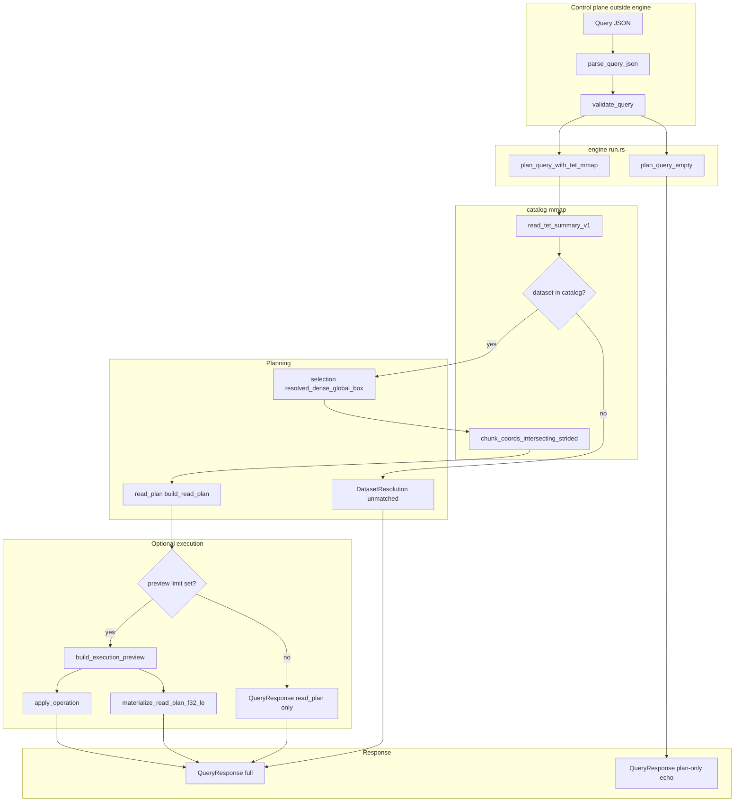
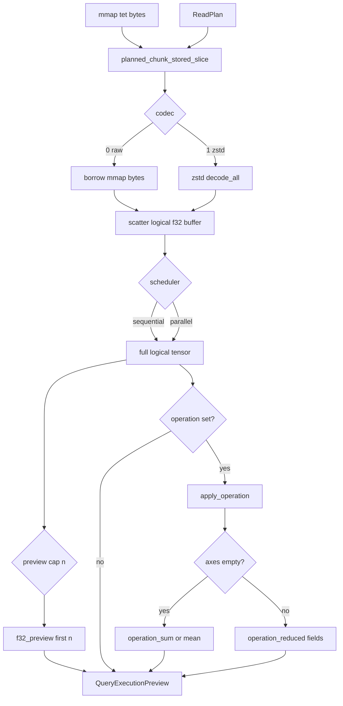

# Query engine

The **query engine** (`src/query/engine/`) turns a validated JSON [`QueryDocument`](../src/query/types.rs) into a [`QueryResponse`](../src/query/types.rs): catalog resolution, a chunk-level **read plan**, and optionally mmap-backed **`f32`** decode plus **`operation`** aggregates.

JSON parsing and schema validation live in **`document.rs`**; wire types and error enums live in **`types.rs`**. The engine assumes a parsed, validated document and a mmap’d `.tet` byte slice when planning against a file.

## End-to-end flow

**CLI mapping:** `tet query` calls `validate_query` then `plan_query_empty` or `plan_query_with_tet_mmap`. `--tet PATH` supplies the mmap; `--execute` sets `raw_f32_preview_max` (default **64**; **`--preview-f32 0`** with an `operation` skips preview floats but still aggregates).

## Module map

| Module | File | Responsibility |
| ------ | ---- | -------------- |
| **run** | `run.rs` | Public entrypoints: `plan_query_empty`, `plan_query_with_tet_mmap`; builds `QueryResponse`; dataset match / miss. |
| **selection** | `selection.rs` | JSON `selection` → half-open global box `[g0, g1)` and per-axis `step` (default full tensor, step 1). |
| **read_plan** | `read_plan.rs` | `ReadPlan`: chunk I/O rows + selection geometry (`logical_selection_shape`, `logical_f32_element_count`). |
| **indexing** | `indexing.rs` | Row-major linear index ↔ multi-dimensional coords (shared by materialize and reductions). |
| **materialize** | `materialize.rs` | Mmap slice + codec decode (raw **0**, zstd **1**); scatter into **logical row-major** `f32` buffer; `materialize_read_plan_f32_le` / `_into`. Shared per-chunk scatter via `scatter_chunk_into_plan`. |
| **parallel** | `parallel.rs` | Rayon `par_iter` over `ReadPlan.chunks`; `materialize_read_plan_f32_le_parallel` / `_into_parallel` (same semantics as sequential; disjoint logical-index writes). |
| **operations** | `operations.rs` | `sum` / `mean` over decoded tensor; scalar (`axes: []`) or partial (`axes: ["0", …]` decimal indices); `build_execution_preview`. Uses **sequential** materialize today. |

Public re-exports are wired in [`engine/mod.rs`](../src/query/engine/mod.rs) and [`query/mod.rs`](../src/query/mod.rs) (crate root: `tetration::plan_query_empty`, `materialize_read_plan_f32_le`, `materialize_read_plan_f32_le_parallel`, …).

## Planning detail

From `QueryDocument` + catalog metadata:

1. **`selection.rs`** — resolve per-axis box → `g0`, `g1_exclusive`, `step`.
2. **Chunk-touch policy** — if any `step ≠ 1`, use `strided_half_open`; else `dense_half_open_unit_step`.
3. **`catalog`** — `chunk_coords_intersecting_strided` → chunk coord list.
4. **`read_plan.rs`** — `build_read_plan` → `ReadPlan` (chunk I/O rows + `logical_selection_shape`).

Each `ReadPlan.chunks` entry names one on-disk tile that intersects the selection. Chunk iteration order follows the catalog writer (last axis fastest); **decoded values** are **not** in chunk order—they are scattered into logical row-major selection order during materialization.

## Materialization and operations

- **`materialize_read_plan_f32_le(mmap, plan, None)`** — full logical tensor (caller must size for `logical_f32_element_count`).
- **`materialize_read_plan_f32_le_into`** — same decode path into a caller-owned `&mut [f32]` (no `Vec` allocation for the output).
- **`materialize_read_plan_f32_le_parallel`** / **`materialize_read_plan_f32_le_into_parallel`** — same APIs; Rayon over planned chunks (raw and zstd). Not wired into `tet query --execute` yet.
- **`planned_chunk_mmap_slices`** — zero-copy raw codec slices only (no zstd).

## `QueryResponse` fields (engine-produced)

| Field | When set |
| ----- | -------- |
| `catalog` | Always with `--tet` / `plan_query_with_tet_mmap`. |
| `read_plan` | Dataset matched; lists touched chunks and selection geometry. |
| `execution` | `raw_f32_preview_max` is `Some(n)` (including `n = 0` when `operation` is set). |
| `execution.f32_preview` | First `n` logical row-major floats (`n = 0` → empty vec). |
| `execution.operation_*` | Full decode + `sum` / `mean`; preview cap does not truncate aggregates. |

## Chunk-touch policy strings

Stable tokens on `ReadPlan.chunk_touch_policy` (see [`CHUNK_TOUCH_POLICY`](../src/query/types.rs)):

- **`dense_half_open_unit_step`** — JSON `step` omitted or 1; chunk list follows dense half-open intervals.
- **`strided_half_open`** — per-axis JSON `step` affects which chunks are touched.

## Related docs

- On-disk layout: [`layout_v1.md`](layout_v1.md)
- Contributor ops: [`AGENT.md`](../AGENT.md)
- Roadmap checklist: [`GETTING_STARTED.md`](../GETTING_STARTED.md)

## Intentional gaps (v1)

- **`tet query --execute`** and **`build_execution_preview`** still call **sequential** materialize; use **`materialize_read_plan_f32_le_parallel`** directly for parallel decode.
- Materialization and operations are **`f32`** / `DTYPE_F32` only.
- `operation.axes` uses **decimal dimension indices**, not dataset name labels.
- No spill-to-disk or streaming API for tensors larger than RAM.
